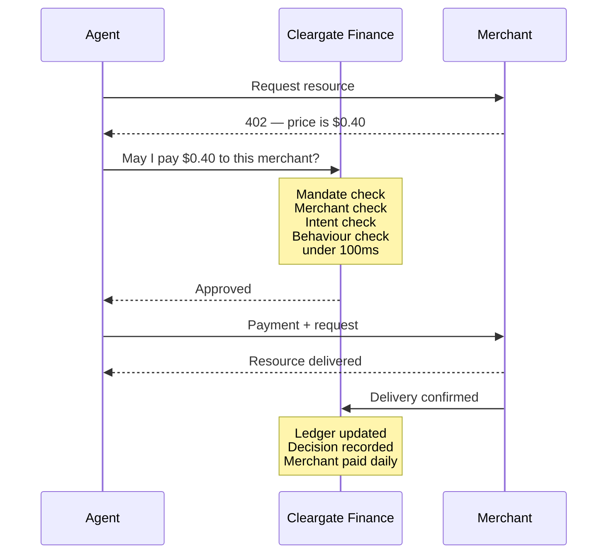
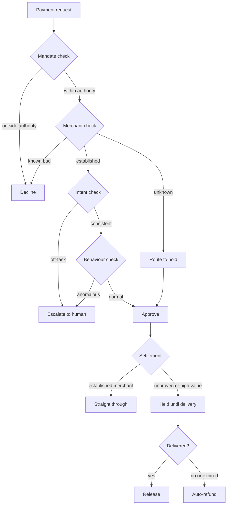
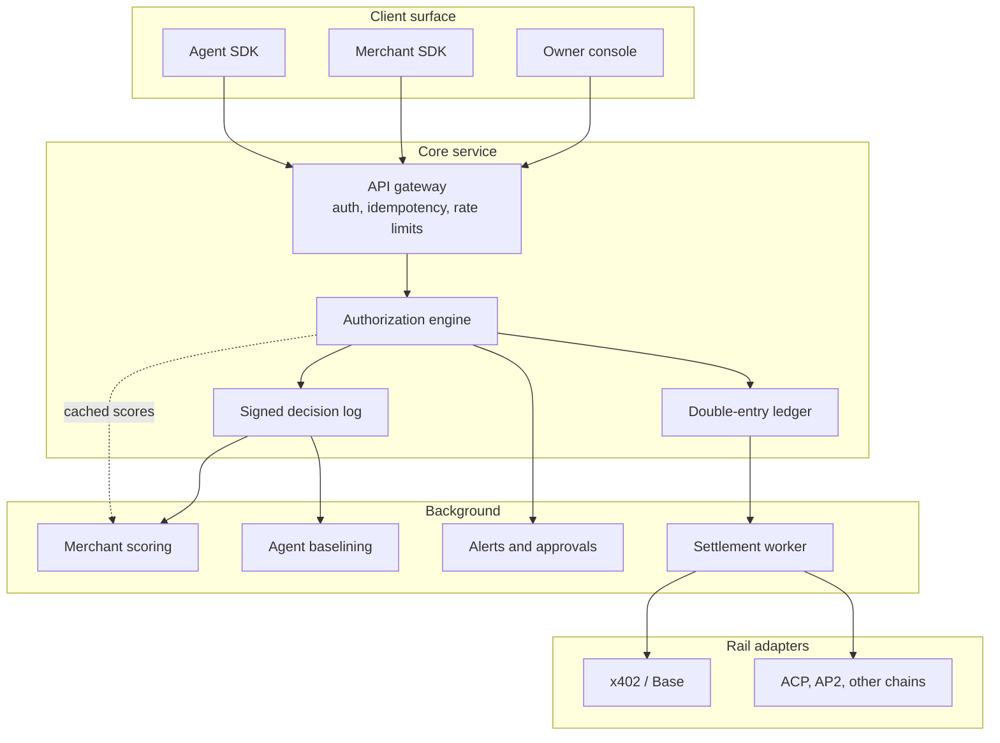
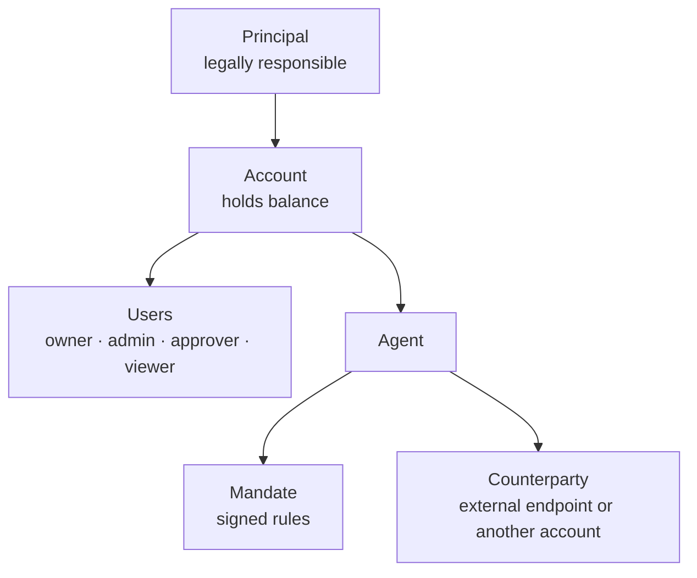
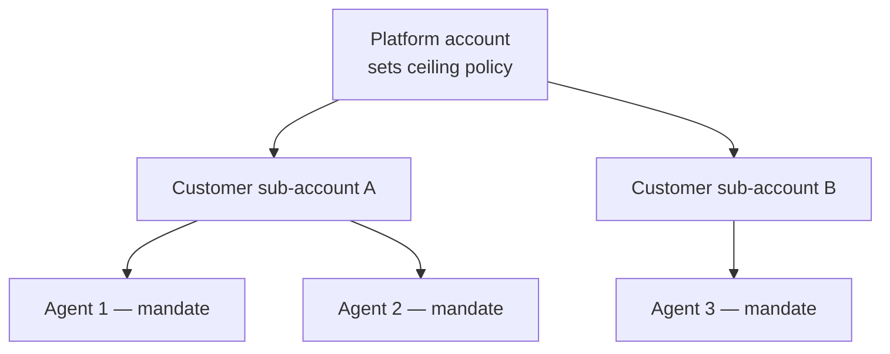

# Cleargate Finance

### Guaranteed stablecoin payments for autonomous agents

**Whitepaper v1.1**
*August 2026*

---

## Abstract

Autonomous agents can now pay for things. Protocols such as x402, ACP and AP2, settled in stablecoins, have made machine-to-machine payment technically trivial. What has not been built is the party that stands behind those payments.

Today an agent's purchase is a push payment: irreversible, unverified, and unbacked. If the agent is hijacked, the money is gone. If the merchant does not deliver, the money is gone. And when a purchase is disputed, no participant in the current stack accepts the loss — not the payment scheme, not the model provider, not the issuer. The merchant absorbs it, without any of the fraud signals that historically protected them.

Cleargate Finance sits between agents and merchants and guarantees the transaction. Agent owners connect their agents through a simple account, fund it with a card or bank transfer, and set spending rules — never touching a wallet, a chain, or a gas token. Merchants integrate once and receive guaranteed settlement: if a Cleargate-approved payment is disputed, Cleargate covers the loss, not the merchant.

Every payment is authorized before it executes, checked against a signed mandate, a merchant risk model, and the task the agent was actually given. Every decision is recorded in human-readable form. The result is a payment that both sides can trust in a transaction where no human was present.

---

## 1. Purpose

Cleargate Finance exists to make agent commerce safe enough that both sides participate.

Three outcomes define the system:

1. **An agent cannot spend outside the authority its owner granted it.** Authority is enforced below the model, where a compromised prompt cannot reach it.
2. **A merchant who accepts an agent payment keeps the money.** Disputes are absorbed by Cleargate, not passed back to the merchant.
3. **Both sides can see and prove what happened.** Every decision — including the payments that were blocked — is recorded, signed, and readable.

A secondary purpose becomes the durable business: operating this layer produces the delivery and default record of the machine economy, a dataset that does not currently exist.

---

## 2. The problem

### 2.1 What is already solved

The payment primitive is finished and commoditizing. Transport protocols provide standard, low-overhead payment handshakes at zero protocol fee. Stablecoins settle in seconds at negligible cost. Wallet and key management is available from a dozen vendors. Identity registries provide a way to name an agent.

None of these are differentiated opportunities.

### 2.2 Liability is unassigned

This is the central unsolved problem, and it is not technical.

In every proposed agentic commerce protocol, the merchant remains the merchant of record. They absorb the risk of autonomous execution while losing the historical fraud signals — device fingerprints, browsing behaviour, geolocation, card-present indicators — that previously protected them. The payment schemes will not take the liability. Consumers will not. Issuers will not. Model providers explicitly will not.

Regulation E and the EU AI Act apply only partially, leaving significant gaps around authorization and liability.

Stablecoin rails make this materially worse. They settle with finality and no reversal, so they have no native answer to disputes at all. There is no chargeback mechanism to fall back on.

Critically, **recognition and authorization are separate problems that the current stack conflates**. Trusted Agent Protocol establishes whether an agent is real. Tokenized credentials establish what it is permitted to spend. Neither establishes what happens when the purchase is disputed.

Liability cannot be solved by a protocol. A protocol has no balance sheet. It can only be solved by a legal entity with capital that agrees to absorb the loss — which is the opening Cleargate Finance occupies.

### 2.3 Security is genuinely unsolved

Agents are steered by language, which makes indirect prompt injection a permanent attack surface rather than a bug to be patched.

Benchmark work on LLM agents shows mixed-attack strategies reaching **84% average attack success across 13 model backbones**, with all eight evaluated defences bypassable through adaptive attacks. This is not a defence gap that will close with better filtering. It is structural: a model cannot reliably distinguish trusted instructions from untrusted content when both arrive as text.

Live evidence confirms the exposure. In May 2026 an attacker embedded a transfer instruction in Morse code in a public reply; a model decoded it, a connected agent treated the decoded output as an executable command, and approximately $175,000 moved to the attacker. There was no transaction limit, no secondary confirmation, and no anomaly detection anywhere in the chain.

On the commerce side specifically, Unit 42 warns that agents able to autonomously trigger refunds invite bot farms initiating thousands of returns within an hour — potentially draining a retailer's cash reserves before anyone notices. **78% of financial institutions expect fraud to spike from AI shopping agents.**

The correct security posture follows directly: **assume the model will be compromised, and constrain what a compromised model can do.** Cleargate Finance does not claim to prevent prompt injection. It guarantees containment — a compromised agent cannot exceed its mandate.

### 2.4 Trust has not arrived

A June 2026 report found that **only 14% of consumers trust AI to execute purchases without verification.**

This is a market-timing signal. Consumer agentic commerce is not imminent, which is why Cleargate Finance targets businesses running agents first. It is also a demand signal: the trust deficit is precisely what a guarantee addresses.

### 2.5 Merchants are flying blind

Merchants historically observed impressions, clicks, dwell time and funnel drop-off. Agent traffic produces almost none of these signals, making it difficult to justify investment even where the payment plumbing works.

Merchants currently face a binary choice: block agent traffic entirely, or accept it blind. There is no middle setting. Cleargate Finance provides one — accept backed agents, reject unbacked ones — which converts the platform from an optional add-on into the credential that grants access.

### 2.6 Market timing, stated honestly

Agent payment volume today is small. Protocol-level activity measures in the tens of millions of dollars per month, a meaningful share of which is not genuine commerce. The qualified merchant supply side numbers in the low thousands.

**This is not a large market today.** The strategy accounts for that explicitly: revenue in the first eighteen months comes from subscription and visibility products that do not depend on transaction volume, while the guarantee business is an option on 2028–2030 activity. Any plan requiring agent commerce to be large in 2026 fails.

---

## 3. What Cleargate Finance is

Cleargate Finance is a company that sits between agents and merchants, guarantees the payments that pass through it, and gives both sides a reason to trust a transaction where no human was present.

**To the agent owner:** an account with agents in it. Each agent has spending rules, a balance, and a readable log of everything it bought and everything it was prevented from buying. No wallet, no chain, no gas.

**To the developer:** one SDK that wraps the agent's HTTP client. Any payment request is handled automatically.

**To the merchant:** guaranteed settlement. Accept agent payments, get paid daily, keep the money if a dispute occurs.

**To an enterprise:** a policy and audit layer over agent spending, with attribution, approval workflows and exportable records.

### 3.1 What it is not

- **Not a payment rail.** It routes over x402 and, later, ACP, AP2 and card rails.
- **Not a wallet.** Key management is commoditized and outsourced.
- **Not an identity registry.** External registries are consumed as weak signals.
- **Not a marketplace.** Discovery is a different business.
- **Not a DeFi product.** Transfers, swaps and treasury management are explicitly out of scope.

---

## 4. Core concepts

### 4.1 The entities — what things *are*

The platform is built on a small set of entities, each with its own identity and lifecycle. The governing principle is to **separate what something *is* from what it *does*.** An account is what a business *is*; paying and receiving are things it *does*.

**Principal** — the human or legal entity ultimately responsible. Liability attaches here, and identity verification (when eventually required) verifies the principal. A principal may own several accounts.

**Account** — the container that holds a balance and everything attached to it: users, agents, registered services, transaction history. When money moves, it moves in or out of an account. An account is neither buyer nor seller by nature — those are roles it takes on per transaction.

**User** — a human who logs into an account and acts, at a defined permission level. Distinct from the principal: the principal is *responsibility*, users are *access*. One company has one principal but may have many users.

**Agent** — the autonomous actor connected to an account. It holds a mandate and initiates payments. Not a human, not a login — the automated actor doing the transacting.

**Mandate** — a signed grant of spending authority issued to an agent. Contains maximum per transaction, per day and per month; permitted categories; time-to-live; subagent delegation depth; and the human approval threshold. Signed by a user with authority, versioned, and verified by Cleargate before every payment.

**Counterparty** — anyone an agent transacts *with*. May be an external endpoint or another account on the platform. Reputation attaches here — age, transaction count, delivery rate, price stability, dispute history — independent of who the counterparty is. A counterparty record can exist without an account and later be *linked* to one when that party signs up, inheriting the reputation already accumulated.

### 4.2 The roles — what things *do*

Roles are not new entities; they describe how an entity participates in a given moment.

**Transaction roles**, assumed per payment:

- **Payer** — the account whose agent is spending. Exactly one per payment.
- **Payee** — the party receiving payment and expected to deliver. This is what was historically called "the merchant." Reputation attaches to this role. A payee may be an on-platform account or an external endpoint — the role is identical either way.
- **Approver** — a user who signs off when a payment escalates.
- **Backer** *(later)* — whoever underwrites guarantees for a class of counterparties.

The key consequence: **"merchant" is not an entity type — it is an account acting in the payee role.** Any account can occupy it. This is what makes agent-to-agent payment the same code path as agent-to-merchant payment.

**Permission roles**, governing what a user may do within an account: **owner** (everything, including billing), **admin** (manage agents and mandates, not billing), **approver** (approve escalated payments, not change mandates), **viewer** (read-only console and reports). This permission model is also the enterprise segregation-of-duties mechanism — the user who sets a policy need not be the user who approves an exception.

### 4.3 Transaction and settlement concepts

**Decision** — the approve, hold, escalate or decline outcome for a single payment request, evaluated in under 100 milliseconds.

**Decision record** — the immutable, signed log entry for every evaluated payment, including the mandate version in force at the time. This is the evidence that makes the guarantee credible.

**Hold** — a conditional settlement where funds are committed but released only on confirmed delivery, with automatic return to the buyer on expiry.

**Guarantee** — Cleargate's contractual commitment that an approved payment, if disputed under defined conditions, is covered by Cleargate rather than by the payee.

**Internal ledger** — the double-entry record of all balances and obligations. Payments authorize instantly against the ledger; the chain is settled periodically in aggregate.

---

## 5. How it works

### 5.1 The agent owner journey

**Setup, once:**

1. Sign up with a company email. No crypto knowledge required.
2. Fund the account by card or bank transfer.
3. Register an agent. Set rules: maximum per purchase, monthly cap, permitted categories, approval threshold.
4. Copy an API key into the agent's configuration.

**Ongoing:** the agent works. When it needs to buy something, it buys it. The owner does nothing.

**In the dashboard**, the owner sees plain language:

```
2:14pm  paid $0.40 to weather-api.com for forecast data     delivered
2:19pm  paid $2.00 to news-api.io for article search        delivered
2:31pm  BLOCKED $85 to newsite.xyz  over $20 limit, domain 3 days old
        Spent today: $12.40 of $200 monthly
```

### 5.2 The merchant journey

**Setup, once:**

1. Register as a merchant.
2. Add one call to the server: on successful delivery, notify Cleargate.
3. Provide payout details.

**Ongoing:** agents pay. Settlement arrives daily. If a payment is disputed, Cleargate absorbs it.

The merchant proposition is one sentence: **accept agent payments with zero risk — if it goes wrong, we pay.**

### 5.3 Connection models — one account, three ways to use it

After signup, a business is not forced down a single path. There is one signup for everyone — no "are you a business?" question — and an account is created with a single user who is implicitly the owner, so a retail user never encounters roles or permissions. The only branch that matters at the start is *intent*: what does the account want to do?

An account has two capabilities it can attach:

- **Connect agents** → so it can *buy* (payer side). Requires funding and mandates.
- **Register services** → so it can *sell* (payee side). Requires a payout destination and delivery confirmation.

The three models are simply which capabilities an account attaches:

**Buyer only.** A company running agents that purchase APIs, data, compute, or other agents' services. Setup: fund the account, connect an agent, set its mandate. No services registered.

**Seller only.** A headless merchant, API, or any business that only wants to *receive* payments. Setup: register a service (endpoint, price, delivery-confirmation method), set a payout destination (bank account via off-ramp partner, or stablecoin address), add one delivery-confirmation call to the server. No agents, no mandates, no funding — the mirror image of the buyer setup. Other accounts' agents pay this account; it acts as payee, delivers, is paid out daily, and accumulates payee reputation.

**Both.** The characteristic machine-economy business: it buys through its agents *and* sells through its services, on one account with one balance. It is payer when its agents spend and payee when its services are bought. No second account, no "merchant mode" — the role is decided per transaction.

Business machinery reveals itself only when needed: team roles appear when a second user is invited, tax details when an invoice is required, identity verification when volume crosses a threshold. A retail user gets a clean experience not because they were routed into a "personal mode," but because that complexity legitimately does not exist yet for an account of one. A buyer-only user who later registers a service simply adds it to the same account — no migration, no second signup.

### 5.4 A single transaction



Steps three and four are the entire company. Everything else is plumbing.

### 5.5 Failure cases

| What happens | System response | Loss |
|---|---|---|
| Merchant takes payment, delivers nothing | No confirmation arrives; buyer auto-refunded; amount deducted from merchant's next payout; merchant flagged network-wide | Merchant's |
| Agent hijacked, attempts a large transfer | Blocked at the mandate check — over limit, unknown destination; owner alerted | None |
| Owner disputes a purchase the agent made | Signed mandate and decision record checked. Inside mandate: owner pays. Outside mandate: Cleargate approved it in error and covers it | Determined by record |
| Coordinated refund farm against one merchant | Pattern visible across all merchants simultaneously; blocked centrally | None |
| Agent retries after timeout | Idempotency key returns the original result; no second payment | None |

---

## 6. The authorization engine

Four checks run in sequence before any money moves.



### 6.1 Mandate check

The owner's spending rules, cryptographically signed and evaluated server-side. Model output is treated as a *request*, never as an instruction.

This is the control that contains hijacking. An injected instruction is still followed by the model — Cleargate makes no claim to detect injection — but it meets a wall: amount above the cap, category not permitted, destination unknown, magnitude anomalous. A catastrophic loss becomes a declined transaction and an alert.

Because mandates are signed by the owner, a compromise of Cleargate's own database cannot fabricate spending authority.

### 6.2 Merchant check

**The owner never enumerates merchants.** An agent discovers most of what it buys at runtime; requiring pre-approval would make the system unusable.

Card networks resolved this decades ago. When a cardholder taps at an unfamiliar shop, the network knows the merchant even though the cardholder does not, because thousands of others have transacted there. **Identity and risk are supplied by the network, not the account holder.**

Mandates therefore express classes and limits, never instances: *data and inference APIs, maximum $20 per call, hold anything unproven.* No URLs appear in a mandate.

Merchants are scored in four layers:

**Layer 1 — Passive signals, available instantly with zero history.** Domain age, TLS certificate age and issuer, DNS and hosting reputation, threat-intelligence and phishing feeds, price sanity against category norms, consistency between advertised payment metadata and the live endpoint, and provenance — whether the URL came from the agent's original task or appeared mid-session from fetched content. That last signal is the primary tell for injection and SEO-poisoning attacks.

**Layer 2 — Network history.** Once any participant transacts with a merchant, every subsequent participant benefits. The thousandth customer to encounter an endpoint receives a score built by the previous nine hundred and ninety-nine.

**Layer 3 — Merchant opt-in.** Merchants seeking instant settlement register and, later, post a bond. This is how a legitimate new merchant escapes cold-start in days rather than months.

**Layer 4 — The hold, which is the actual answer to cold start.** An unknown merchant is **held, not declined**. Funds are committed, delivery is verified, funds release. Exposure approaches zero regardless of who the merchant turns out to be, the agent still completes its task, and the transaction produces the first data point for Layer 2.

Cold start ceases to be a problem the moment the system stops trying to solve it through detection.

Two asymmetries make this work: **trust accrues slowly, distrust propagates instantly** — one confirmed non-delivery flags a merchant network-wide within seconds — and **the cost of being wrong is bounded by the hold, not by the payment value.**

### 6.3 Intent check

The stated purpose of the payment is compared against the task the owner assigned. Hijacking characteristically produces payments that are *off-task* — a research agent suddenly buying a licence, an agent suddenly paying an address unrelated to its work. Off-task spending is a cheap, high-signal detection surface requiring no adversarial model analysis.

### 6.4 Behaviour check

Agent behaviour is far more predictable than human behaviour. Human card spending is noisy — travel, irregular purchases, changing habits — which is why bank fraud models need enormous data and still produce poor false-positive rates. An agent runs a loop: the same endpoints, similar amounts, similar cadence.

An agent that has paid five known endpoints ten thousand times and then sends forty times its typical amount to a domain registered days earlier is a trivially detectable anomaly. A z-score and a novelty flag catch it; no machine learning is required.

Bank fraud features cannot be ported — no device fingerprint, no geolocation, no browsing history. The feature set is machine-native: merchant age and history, price deviation, delivery rate, spend-to-task ratio, subagent depth, time since mandate issue, rate of novel merchants per session.

### 6.5 Detection roadmap

| Phase | Capability | Rationale |
|---|---|---|
| Launch | Deterministic rules: caps, categories, velocity, novel-merchant friction | ~80% of the value; the only version explicable to an auditor |
| Months 3–6 | Per-agent statistical baselining | High signal, no labelled data required |
| Months 6–12 | Merchant scoring from delivery outcomes | The proprietary dataset |
| Year 2+ | Supervised models | Requires thousands of confirmed loss events |

### 6.6 Operating constraints

**Latency.** The straight-through decision must land under 100 milliseconds. Nothing slow runs in the request path: no chain calls, no model inference, no external HTTP. Merchant scores are precomputed offline and cached.

**False positives are more damaging than with cards.** A blocked human retries with another card; a blocked agent fails its task mid-run with nobody watching. The default action on suspicion is **hold and notify**, not deny. Outright decline is reserved for hard mandate violations. False-positive rate is a headline metric from day one.

### 6.7 What the system does not stop

Stated plainly, because overclaiming creates legal exposure under a guarantee:

- Prompt injection itself. Containment is guaranteed; prevention is not available.
- A trusted merchant quietly degrading quality while still technically delivering.
- Subjective quality judgements. Verification covers deliverable-shaped conditions — status, schema, hash, completion. "Was the analysis good?" is not machine-verifiable.
- Compromise of the agent runtime itself, including malicious tools and poisoned tool descriptions. That is an agent-security problem, not a payments one.
- Poor agent decisions within policy. Cleargate bounds authority; it does not improve judgement.

---

## 7. Disputes and liability

### 7.1 Disputes are a design failure, not a process to optimise

A card network learns about a problem weeks later, when a cardholder reviews a statement. By then the merchant has shipped, money has moved, and both sides argue from incomplete records.

Cleargate Finance stands in the transaction as it happens. It holds the mandate that was active, the purpose that was stated, and the delivery confirmation. Most disputes should therefore not exist.

| Dispute type | Why it should not occur | Residual |
|---|---|---|
| "The agent shouldn't have bought this" | The purchase was checked against a signed mandate before approval. Inside it, the owner authorized it and the record proves so. Outside it, Cleargate erred and absorbs the loss | Becomes a lookup, not a debate |
| "The merchant didn't deliver" | Unproven merchants are held; release requires confirmation; expiry auto-refunds | Near zero |
| "Delivered but useless" | Cannot be designed away — requires human judgement | The only category needing real process |

**The operating metric is loss rate as a percentage of guaranteed volume.** Card fraud runs roughly 0.05–0.1%. Above approximately 0.5%, the economics do not work. This is tracked from the first transaction.

### 7.2 How losses are covered

The model evolves in three stages. Cleargate Finance does not begin as an insurance company.

**Stage 1 — Own reserve (months 0–12).** A fixed reserve from the seed round backs guarantees capped at a low per-transaction limit with a hard monthly aggregate ceiling. The purpose is not profit. **The purpose is to buy loss data** — what fraction of transactions fail, which merchant categories are risky, what a typical loss costs. This is budgeted as customer acquisition cost.

**Stage 2 — Merchant-funded (months 12–24).** Three standard payments mechanisms shift merchant-side losses onto merchant-side money:

- **Delayed settlement.** New merchants settle T+7; merchants with clean history settle same-day. The delay *is* the protection — an undelivered order has not yet been paid out.
- **Rolling reserve.** 5% of every merchant's payouts held on a trailing basis, forming their own clawback buffer.
- **Netting.** A refund owed is deducted from the next payout. Economically identical to a chargeback, requiring no reversibility.

Remaining exposure at this stage is Cleargate's own errors — payments approved that should not have been.

**Stage 3 — Reinsured (year 2+).** With real loss data, a reinsurer writes a policy. Cleargate operates as a **managing general agent**: performing pricing, underwriting and the customer relationship while the reinsurer holds the capital. The spread between premium cost and what merchants and owners pay is margin, captured without a large balance sheet.

**Governing rule:** never guarantee an amount that could not be lost entirely. Limits widen only on observed data, never on customer request.

### 7.3 Why this cannot be copied by a protocol

A protocol has no balance sheet and cannot accept liability. Only a capitalised legal entity can. This is the structural reason the position is defensible against open standards, and the reason the loss dataset — which unlocks reinsurance — is the company's core asset.

---

## 8. Architecture

### 8.1 Principles

**Start as a monolith.** Microservices solve an organizational problem that a small team does not have, while introducing distributed-transaction complexity precisely where atomicity matters most. One service with clean internal module boundaries; split only when a component demonstrably needs different scaling. The one early exception is chain interaction, isolated as a queue-driven worker so RPC unreliability never enters the decision path.

**Nothing slow in the request path.** All scoring is precomputed offline and cached. The hot path reads cache and evaluates rules.

**Rails are adapters, not dependencies.** The authorization engine never knows what a chain is. It approves or declines; a separate layer determines how value moves.

### 8.2 Component view



### 8.3 The ledger

Double-entry bookkeeping. Every movement creates two rows summing to zero:

```
Agent pays $0.40 to a merchant:
    Agent balance       -0.40   debit
    Merchant payable    +0.40   credit
```

Rows are **append-only**. Corrections are new reversing entries, never updates or deletes. This permits reconstruction of system state at any historical moment — required by auditors, regulators, and debugging.

An hourly job sums all entries and confirms the total is zero. A non-zero result pages immediately. This single check catches a large class of bugs before they compound.

### 8.4 Idempotency

Every money-moving request carries a client-supplied key, stored with its result.

```
Request: pay $5 to merchant-X, key = "abc-123"
Stored:  "abc-123" → approved, payment #4471

Timeout. Agent retries with key "abc-123".
Key found → original result returned. No second payment.
```

Without this, a timeout inside a retry loop produces thousands of duplicate payments in minutes with no attacker involved. This is the most common way payment systems lose money.

### 8.5 Concurrency on balances

Two simultaneous requests against an agent with $10 remaining will both observe $10 and both approve $8 unless locked. Balance reads on the money path use row-level locking or atomic conditional updates.

### 8.6 Settlement and multi-rail

Payments authorize against the internal ledger; the chain settles periodically in aggregate. An agent paying the same merchant 800 times daily at $0.02 requires one net settlement, not 800 transactions.

This produces three benefits simultaneously: sub-100ms authorization independent of block time, gas cost amortized to near zero, and the ability to hold funds at all — which requires controlling timing.

**Cross-chain is solved by float, not bridges.** If a merchant is paid on a different chain than the buyer funded, no cross-chain transaction occurs. The ledger debits and credits internally; the daily payout is drawn from float held on the merchant's preferred chain. Rebalancing between chains is an occasional treasury operation, not a per-transaction concern. Bridges never enter the payment path.

### 8.7 Cryptography

Three concrete uses, no exotic primitives:

- **Signed mandates.** Owner-signed, server-verified. A database compromise cannot fabricate spending authority, and disputes have a provable artifact.
- **Signed decision records.** Both parties can verify a record was not altered after the fact. A guarantee is only as credible as its evidence.
- **Hash-chained audit log.** Each entry includes the previous entry's hash, making historical tampering detectable.

### 8.8 Security of the platform itself

Sitting in the payment path makes Cleargate Finance a target.

- Private keys are never held in-house; key management is delegated to a specialist provider.
- No single individual can move funds; payouts above a threshold require dual approval.
- Secrets in a managed vault, never in source control.
- All actions logged with actor, action and timestamp, including internal administration.
- Rate limits per agent and per account.
- Alerting on spend spikes, new merchants with unusual volume, elevated refund rates, and ledger imbalance.

### 8.9 Engineering practice

CI on every commit; automated deployment to staging; one-click production deploy and rollback. Feature flags to disable behaviour without deploying. Structured logging with a trace ID spanning every step of a request. Load testing before launch. Written runbooks for incident response.

---

## 9. Account model

The entity model from Section 4 arranges as follows: a principal owns an account; the account contains users and agents; each agent holds a mandate; agents transact with counterparties that may themselves be on-platform accounts.



For platform integrators, the same model nests: a platform account sets a ceiling policy, customer sub-accounts sit within it, and agents sit within those.



Retail usage is this hierarchy with the top layers collapsed — the principal is the person, the account is theirs, and there is one user who is implicitly the owner. Identical objects, identical code path. Multi-tenancy is designed in from the first commit because retrofitting it is a rewrite.

**No wallet per agent.** One account per customer with a scoped credential per agent. Creating an agent issues a credential; revoking an agent revokes it instantly, with no funds to sweep. Funding occurs once at the customer level and agents draw just-in-time, so no capital sits idle across hundreds of wallets.

**Policy inheritance.** A platform sets a ceiling; its customer sets policy within that ceiling; the agent operates within that. A child can never widen what a parent set. This bounds platform risk regardless of end-user behaviour — the first question any platform integrator asks.

**Funding models:**

| Model | Who funds | Who bears loss |
|---|---|---|
| Platform-funded | Platform prefunds, allocates per agent | Platform |
| Customer-funded | Each end user funds their sub-account | End user |
| Platform-guaranteed | Customer funds, platform backstops | Platform, capped |

### 9.1 Platform integration

Platforms embed Cleargate Finance rather than using its console:

```
POST   /accounts                    create sub-account
POST   /accounts/{id}/agents        provision agent, return credential
PUT    /agents/{id}/mandate         set or update spending rules
POST   /agents/{id}/revoke          instant revocation
GET    /agents/{id}/decisions       decision history
POST   /mandates/bulk               fleet-wide application
```

Webhooks: `payment.approved`, `payment.held`, `payment.declined`, `approval.required`, `anomaly.detected`, `cap.approaching`, `delivery.confirmed`, `refund.issued`.

**Embeddable components** — a drop-in mandate editor and spend console under the platform's own branding — are what make platforms integrate rather than build. Platforms will not build a policy interface themselves; if forced to, they build the entire system instead.

### 9.2 Enterprise

Enterprises require: dual control above thresholds with named approvers, policy as code within existing change management, budget attribution by agent and cost centre reconciled into ERP, immutable audit trail with SIEM export, segregation of duties between policy author and exception approver, and SOC 2 Type II.

The risk question shifts. The developer product asks "did I receive my API response." The enterprise product asks "did the agent spend in accordance with a mandate a human genuinely authorized, and can that be proven to an auditor." Less fraud detection, more **provable authorization chains**.

### 9.3 Money allocation across agents

Agents do not hold money. They hold *spending authority*. The instinct to give each agent its own wallet or pre-allocated slice is the wrong design; the correct model is the corporate-card model.

**One pooled balance, many limits.** When a company gives an employee a card with a monthly limit, it does not move that amount into a separate account for the employee — the money stays pooled, and the card carries a limit that draws from the shared balance. Agents work the same way. The account holds one balance; each agent's mandate carries limits; spending draws from the pool.

This matters for three reasons. Pre-allocating per agent **strands capital** — an idle agent's slice cannot be used by a busy one, forcing constant rebalancing. Per-agent wallets **multiply the crypto problem** the platform exists to hide — every wallet needs gas, funding, and key management. And scattered balances make **reconciliation** miserable, where one pooled balance with a ledger is a single verifiable number.

**Under the hood.** Funding converts fiat to stablecoin once, at the account level — the fiat-to-crypto friction is absorbed a single time, not per agent. Setting an agent's limit moves no money; it writes a rule into the mandate. When an agent pays, the ledger debits the account balance and increments a *spent counter* for that agent — a meter that enforces the cap, not a balance that holds funds. Authorization checks both levels: does the account pool have the funds, and is the agent under its limits.

Consequently, per-agent "remaining" amounts may sum to more than the account balance — exactly as three employees with limits may collectively be allowed more than sits in the corporate account. Limits are ceilings on behaviour, not reservations of money; actual spending is bounded by `min(agent remaining limit, account balance)`. A "reserved" carve-out for a specific agent can be offered as an advanced option — still one pool, just a counter that comes off the top — but shared is the default and most accounts never need reservation.

The schema consequence is a clean separation between **balance** (actual money, account level, verifiable against on-chain holdings) and **spent counters** (per-agent meters that enforce limits and reset per period). Building agents with balances rebuilds wallets and inherits every problem above; building them with counters against a shared balance is the corporate-card model and scales to any number of agents.

---

## 10. Agent-to-agent payments

Agent-to-agent payment is not a separate product — it is the existing design with the payee happening to be another account. But "agent-to-agent" hides two distinct cases, and the distinction determines what must be built.

**Case A — an agent is a payee.** A provider agent sells a service; a client agent pays for it. From the system's perspective this is *identical* to agent-to-merchant: the provider has an endpoint, quotes a price, is paid, delivers. That the seller is itself an agent changes nothing. The four-layer counterparty check, holds, and delivery verification all apply unchanged. **This case is fully supported by the core design** — because "merchant" is a role any account can occupy, an agent selling a service is simply an account acting as payee.

**Case B — an agent subcontracts a job.** A client agent hires a provider agent to *do work* — analyse a dataset, monitor a feed, write code. This is genuinely different in three ways. Delivery is not a schema check — the deliverable may be the subjective thing itself. The work takes time — minutes, hours, or days — which breaks the short-window assumption of a simple hold. And delegation chains form — provider hires sub-provider — so authority flows through multiple hops.

The foundations for Case B already exist: the mandate model, signed authorization, the delegation-depth field, the internal ledger (an agent-to-agent payment settles as a ledger entry between two accounts, needing no new settlement mechanism), and the decision log. What is not yet built:

- **Milestone holds** — releasing a job's payment in stages against checkpoints rather than one release on delivery, bounding risk on long jobs.
- **A defined acceptance mechanism** — for deliverable-shaped work (tests pass, schema matches) this can be automated; for subjective work it cannot, and those job types are facilitated rather than guaranteed.
- **Chained mandate enforcement** — when one agent hires another, the sub-mandate must be strictly narrower than the hiring agent's authority, signed, and depth-limited. The Bankrbot lesson applies: authority must not propagate implicitly.

**Position.** Case A ships with the core and should be stated as supported today. Case B is the agent-to-agent subcontracting market that is most exciting and thinnest in reality — the qualified seller base is in the low thousands. The disciplined approach is to keep the primitives open — retain the delegation-depth field, keep the hold mechanism flexible enough to become multi-stage, and model the ledger so any account can be both payer and payee — while deferring the Case B machinery to a later phase, timed to when multi-agent commerce is real rather than promised.

The single schema decision that keeps this cheap: **model payee as a role, not a distinct entity, and model an account so it can be both payer and payee.** Get this right at the first table and agent-to-agent is a natural extension rather than a rebuild.

---

## 11. The console

### 10.1 The decision log is the product

Transactions are visible on-chain. What exists only inside Cleargate Finance are the **declines and holds** — and those are the proof of value. A monthly summary reading *"blocked 14 payments, $3,200 at risk, 2 unknown merchants held for review"* is the renewal justification. Most infrastructure struggles to demonstrate value; this system generates the evidence as a byproduct.

### 10.2 Contents

- **Human-readable events, never hashes.** Transaction identifiers sit behind a disclosure control.
- **Every decision, including those where no money moved**, with the reason and the mandate version in force.
- **Causal chain**: payment → the task that triggered it → the agent's stated purpose. This makes a hijack visible in retrospect.
- **Burn-down** against daily and monthly caps.
- **Merchant view**: cumulative spend per merchant with delivery rates.
- **Attribution**: which customer, task or workflow caused which spend.
- **Export**: CSV, accounting integrations, SIEM formats.

### 10.3 Approvals are a latency problem

When a payment requires sign-off, the agent is blocked and waiting. The flow must be near-instant: push or Slack notification, one-tap decision, hard timeout. If approval takes ten minutes, customers raise their thresholds until the control is meaningless — the standard way security features die.

Auto-decline is the default on timeout. Auto-approve must be explicitly chosen, never discovered.

---

## 12. Adjacent problems the platform solves

These are finance-operations problems rather than security problems, which matters commercially: security sells after an incident, finance operations sells on an ordinary Tuesday. All are byproducts of data the system already collects.

**Spend attribution.** Companies running agents cannot determine which customer, task or workflow caused which spend, making unit economics impossible for anyone reselling agent work.

**Zombie subscriptions.** Agents sign up for recurring API access with no central visibility. Across hundreds of agents, recurring charges accumulate that nobody can enumerate or cancel.

**Receipts, invoices and tax.** Thousands of machine transactions with no invoices, no VAT handling and no accounting export — a compliance problem in the EU.

**Price sanity.** Agents do not comparison shop; they pay the quoted price. Knowing category market rates allows overpayment flagging. This is value creation rather than loss prevention, and is a materially easier sale.

**Refunds for honest error.** The agent bought the wrong thing. Normal commerce has returns; agent commerce currently has nothing.

---

## 13. Business model

**Revenue is charged for authorization and assurance, not as a percentage of payment value.** This makes the business viable before agent volume is meaningful — and it is correct regardless, since the rails themselves are free.

| Line | Basis | Timing |
|---|---|---|
| Free tier | Logging, console, visibility | The wedge |
| Per agent per month | Mandate enforcement, controls, alerts | **Primary revenue, months 0–18** |
| Merchant settlement fee | Guaranteed daily settlement | From merchant launch |
| Per protected transaction | Buyer protection on held volume | Scales later |
| Enterprise | SSO, SOC 2, attribution, audit export | Highest ACV |
| Guarantee spread | Basis points on guaranteed volume | Requires loss data first |
| Merchant data | Delivery reputation, category benchmarks | Year 3+ |

Pricing is designed so the company remains viable if agent payment volume grows ten times more slowly than expected.

### 12.1 Growth path

**Down the financial stack** — authorization → holding funds → credit → underwriting. Each rung unlocked by data from the one below. Once a million transactions are observed, spending limits can be extended without prefunding; once default can be priced, coverage can be sold.

**Across rails** — x402 first, then ACP, AP2 and card rails. Merchants are half the network and card rails carry merchant volume.

**Across actor types** — software agents, then robotics and industrial systems. The primitive is identical: mandate, decision, settlement, audit trail.

**Into compliance** — when regulators require proof of who authorized a machine to spend, every regulated entity running agents needs precisely this audit trail.

### 12.2 End state

Two engines operating together: an **authorization network**, where every machine payment above a trivial size is checked before executing, and a **merchant bureau**, the delivery and default record of the machine economy, licensed at near-zero marginal cost to parties who never route a payment through the platform.

Rails commoditize; reputation compounds.

### 13.3 Expansion opportunities

Every product the platform can build stands on one of two assets: **the position** (sitting in the payment path) or **the data** (the verified delivery and default record). The strongest use both. The organizing insight is that **payments is the wedge, not the destination** — the payment product exists to collect behavioural truth about machine actors, which is what gets sold, in different forms, to different buyers, for the next decade.

**Merchant onboarding (near-term).** Making a business agent-ready — wrapping an existing endpoint, generating payment and product metadata, handling the protocol — in an afternoon. This is simultaneously a product and the mechanism for acquiring the supply side; every merchant onboarded enriches the delivery graph.

**The reputation bureau (the largest opportunity).** The platform will possess the *verified* delivery record of every merchant in the machine economy — observed, not self-reported, and therefore not fakeable. This supports a displayable reputation score, a reputation-as-an-API business sold to parties who never route payments through the platform (detaching revenue from the platform's own volume), and portable merchant identity that makes the platform the issuing authority. A bureau's credibility scales with coverage, making this a year-three product enabled by a year-one data decision.

**Buyer-side intelligence.** Price intelligence (flagging overpayment against category market rates — value creation, an easy sale), spend analytics and attribution (a company's agent unit economics), and a discovery signal held as an option rather than chased, since discovery is a different business.

**Credit (where margin concentrates).** Once default is priceable from delivery history: agent credit lines (spending against a limit rather than prefunding), merchant advances (factoring priced off reputation), and guarantees-as-a-service (buyer protection sold to platforms routing over other rails). Capital-efficiently structured as an MGA. The endgame, carrying the most capital and regulatory weight.

**Compliance (a price-insensitive byproduct).** When regulators require proof that a human authorized a machine to spend, every regulated entity running agents needs exactly the audit trail the platform already produces. Sold on the regulator's timeline, so treated as upside rather than a roadmap commitment.

The ranking by strength and timing: build the *data* for the bureau, analytics, and price intelligence from day one, since capturing it is nearly free and it compounds; build the *products* — the reputation API, credit, guarantees-as-a-service — once scale makes them credible; and hold discovery, compliance tooling, and any DeFi transaction-guarding as options rather than chasing them, since each is a different business that would fragment focus.

---

## 14. Distribution

**Ship as an MCP server.** This is the highest-leverage distribution move available. Adoption becomes one line of configuration rather than an SDK integration.

**Free tier first.** Logging and visibility are given away. This places Cleargate Finance in the payment path before any customer has been attacked, and accumulates merchant data from day one with no cold-start problem. Protection is the upsell once the platform is already load-bearing.

**Platforms over individual developers.** One integration with an agent platform or marketplace reaches thousands of agents and populates the merchant graph far faster than individual signups.

**Merchant cold-start via bounded guarantee.** Approach the first twenty merchants and offer to cover losses on agent transactions at zero cost to them, capped at an affordable level. This buys merchant integration with a small amount of risk capital rather than waiting for volume. Once merchants accept backed agents preferentially, the buyer side has a reason to exist.

**Publish the loss data.** Becoming the authoritative public source on agent payment fraud generates inbound and establishes the category.

---

## 15. Customers

The buying persona is whoever is financially liable when the agent is wrong.

| Segment | Pain | Revenue | Role |
|---|---|---|---|
| **AI companies running agents that buy APIs, data, inference** | Real today; no spend visibility, no attribution | Medium | **Start here** |
| **Agent platforms and marketplaces** | Must offer users payments; will not build risk | Medium, high leverage | Fastest data accumulation |
| **API and data merchants** | Cannot verify buyers; absorb all dispute risk | Low direct | Supply side; generates the delivery record |
| **Enterprises running internal agents** | Governance and audit pressure | Highest ACV | 2027, SOC 2 gated |
| **Consumers** | 14% trust rate | Negligible | Not a near-term market |

---

## 16. Roadmap

**Phase 0 — Foundations (months 0–3).** Ledger and decision log schema. Mandate model and signing. Deterministic rules engine. TypeScript SDK and MCP server. Free logging tier. Three design partners routing live transactions. **Delivery outcomes instrumented from transaction one.**

**Phase 1 — Control (months 3–9).** Mandate enforcement, caps, categories, approval workflow with sub-minute response. Owner console with full decision history. Python SDK. Per-agent baselining. First paid tier.

**Phase 2 — Merchants (months 9–18).** Merchant SDK and delivery confirmation. Daily settlement, delayed settlement tiers, rolling reserves. Held payments with auto-refund. Merchant scoring from delivery data. Bounded guarantee programme with first twenty merchants.

**Phase 3 — Assurance (months 18–36).** Guarantees at scale under an MGA structure with reinsurance. Enterprise features and SOC 2 Type II. Platform API, multi-tenancy, embeddable components. Additional rails.

**Phase 4 — Bureau (year 3+).** Merchant reputation licensed externally. Credit extension against demonstrated history. Additional actor types.

---

## 17. Risks

| Risk | Assessment | Mitigation |
|---|---|---|
| **Market stays small through 2028** | Highest-probability failure mode | Subscription and visibility revenue independent of transaction volume |
| **Incumbent ships it as a feature** | Likely from wallet or CDN providers | They will not underwrite risk. Competing on rules loses; competing on loss data and guarantees does not |
| **Underwriting losses exceed capacity** | Ends the company in one quarter | Conservative limits; guarantee only what can be lost entirely; reach MGA structure before scaling |
| **False positives drive churn** | Blocking a legitimate agent costs more than the fraud prevented | Hold-and-notify default; publish false-positive rate |
| **Custody structure decided late** | Discovery at month 18 means a rewrite plus a year of licensing | Decide before writing the ledger |
| **Verification overreach** | Promising judgement on subjective quality creates legal exposure under a guarantee | Deterministic conditions only; explicit in contracts |
| **Platform compromise** | High-value target in the payment path | External key management; no unilateral fund movement; signed mandates independently verifiable |
| **Availability** | Downtime stops customers' agents | Four nines; real on-call; honest status page |
| **Two-sided cold start** | Merchants need agents; agents need merchants | Bounded guarantee programme to buy the merchant side |

---

## 18. Success factors

1. **Surviving until volume arrives.** Organize around revenue independent of payment volume.
2. **Distribution through platforms and MCP**, not individual developer signups.
3. **Instrumenting delivery outcomes from transaction one.** This is architectural, not a later feature. Without it the product is a rules engine — a three-month build for any competitor.
4. **Not blowing up on guarantees.** Start conservative; widen only on data.
5. **Boring reliability.** Retention in infrastructure is uptime, not features.
6. **False-positive discipline.**
7. **Deciding custody early.**
8. **Filling the team gaps** — agent-ecosystem distribution first, payments risk expertise second.

---

## 19. Open questions

To be resolved before or during Phase 0:

- **Custody structure** — non-custodial, licensed partner, or control-plane-only as the primary model. This determines licensing, geography and architecture.
- **Verification scope** — the exact deterministic conditions supported at launch, and contractual language bounding liability outside them.
- **Initial guarantee limits** — maximum exposure per transaction, per merchant and in aggregate.
- **Pricing structure** — per-agent subscription versus per-decision versus hybrid, and whether guarantees are priced separately.
- **Merchant bond mechanics** — sizing, slashing conditions, and pricing a merchant with no history.

---

## 20. Immediate next step

Ten conversations with companies running agents, asking what their agents spend monthly and whether they can attribute it. In parallel, ship the smallest thing that creates value at zero risk: an SDK and MCP server that logs every agent payment with merchant, amount, purpose and outcome, plus a dashboard. Give it away.

Everything in this document — the guarantee, the bureau, the credit business — is downstream of possessing a loss book nobody else has. The only way to acquire one is to begin collecting earlier than feels justified.

---

## 21. MVP
The MVP is:
An agent owner funds an account, connects an agent with spending rules, that agent pays for things through Cleargate Finance platform, and the owner sees every payment and every block in a console.

No guarantees, no holds, no merchant onboarding, no reputation. Just: authorize payments against a mandate, move the money, show what happened. That's what you build first, and it's already enough to get design partners routing real transactions — which is the only thing that matters at this stage.

### The MVP components

Here's what that smallest version actually requires, grouped by concern:

The core service (one Go monolith or micro service architecure, internal modules):
1. Gateway — receives payment requests, handles auth, enforces idempotency, rate-limits. The front door.
2. Authorization module — evaluates a payment against its mandate. For MVP this is only the mandate check (caps, categories, velocity). Skip counterparty scoring, intent, and behaviour — those come later. One check, done well.
3. Ledger module — the double-entry ledger. Balances, spent-counters per agent, append-only entries. This is the component you cannot get wrong, so it gets the most care.
4. Mandate module — create, sign, store, version, and verify mandates.
5. Account module — accounts, agents, the entity model (principal, account, users, agents) even if users is just "one owner" for now.
6. Settlement module — turns approved payments into actual USDC movement. For MVP this can be deliberately simple: settle each payment or batch on a timer. The rail adapter interface lives here, with one implementation (Base).

Outside the core:
1. The agent SDK (TypeScript first) — what the customer actually integrates. Wraps their HTTP client, catches 402s, calls your API.
2. The MCP server — the one-line-config adoption path. Can be a thin wrapper over the same API the SDK uses.
3. The console — a web dashboard. Read-heavy: show agents, balances, transactions, blocks. For MVP it can be genuinely simple.
4. On-ramp integration — funding via a partner (MoonPay/Transak/Ramp). You integrate, you don't build.
5. Key management — Turnkey or Privy. You integrate, you don't build.

## Appendix: glossary

**Principal** — the human or legal entity ultimately responsible for an account; where liability and identity verification attach.
**Account** — the container holding a balance, users, agents and services; neither buyer nor seller by nature.
**User** — a human who logs into an account at a defined permission level (owner, admin, approver, viewer).
**Agent** — the autonomous actor connected to an account that initiates payments under a mandate.
**Mandate** — signed grant of spending authority to an agent, enforced below the model and versioned.
**Counterparty** — any party an agent transacts with; may be an external endpoint or another account. Reputation attaches here.
**Payer / Payee** — transaction roles assumed per payment. Payee is what was historically called "the merchant"; any account can occupy it.
**Spent counter** — a per-agent meter that enforces a mandate limit; distinct from a balance, it holds no money and resets per period.
**Decision record** — immutable signed log of an evaluated payment, including approvals, holds and declines.
**Hold** — conditional settlement released on confirmed delivery, auto-refunded on expiry.
**Milestone hold** — a hold released in stages against job checkpoints, used for time-bound subcontracted work.
**Straight-through** — immediate settlement for established payees within limits.
**Rolling reserve** — trailing percentage of payee payouts retained to fund clawback.
**Netting** — deducting an owed refund from a payee's next payout.
**MGA** — managing general agent; prices and writes risk while a reinsurer holds the capital.
**Idempotency key** — client-supplied identifier ensuring a retried request cannot pay twice.
**Bust-out fraud** — building a clean transaction record over time, then exiting at maximum exposure.

---

## Appendix: references

**Liability and agentic commerce**
- [The Hidden Liability of Agentic Commerce](https://samboboev.medium.com/deep-dive-the-hidden-liability-of-agentic-commerce-486506864aa7) — merchant-of-record risk, Regulation E and EU AI Act gaps, separation of recognition from authorization.

**Security research**
- [Attack and defence benchmarking of LLM agents](https://arxiv.org/pdf/2510.06445) — 84% average attack success across 13 backbones; all eight evaluated defences bypassable.
- SlowMist — [Behind the Grok Exploitation: AI Agent Permission Chain Abuse](https://slowmist.medium.com/behind-the-grok-exploitation-an-analysis-of-ai-agent-permission-chain-abuse-4d832d1bfc73) — forensic account of the May 2026 incident.
- OECD AI Incidents Monitor — [Prompt Injection Exploit Drains Agent-Linked Wallet](https://oecd.ai/en/incidents/2026-05-04-4a73).
- Unit 42 — autonomous refund abuse and cash-reserve drain risk. *(Verify current URL before circulation.)*

**Market data**
- Chainalysis — [Inside x402: Agentic Payments Adoption](https://www.chainalysis.com/blog/x402-agentic-payments-adoption/) — transaction-size migration and volume composition.
- Artemis Research — [Machine Economy 2030](https://research.artemisanalytics.com/p/machine-economy-2030) — supply-side and discovery analysis.
- Forkast — [Cloudflare gives AI agents a budget](https://forkast.news/cloudflare-just-gave-ai-agents-a-budget-now-the-agents-can-finally-pay/) — 14% consumer trust figure.
- [x402.org](https://www.x402.org) — protocol specification and live metrics.

**Requiring verification before external circulation**
The 78% financial-institution fraud expectation figure, the Unit 42 refund-farm analysis URL, and consumer trust survey methodology should each be traced to primary sources before this document is shared externally.

---

*Whitepaper v1.1. This revision adds the full entity and role model (principal, account, user, agent, mandate, counterparty), the payee-as-a-role framing, the three connection models (buyer, seller, both under one account), money allocation across agents, agent-to-agent payments, and expansion opportunities. Regulatory statements are not legal advice and require review by qualified EU payments counsel.*
