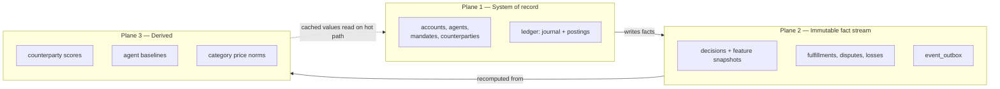
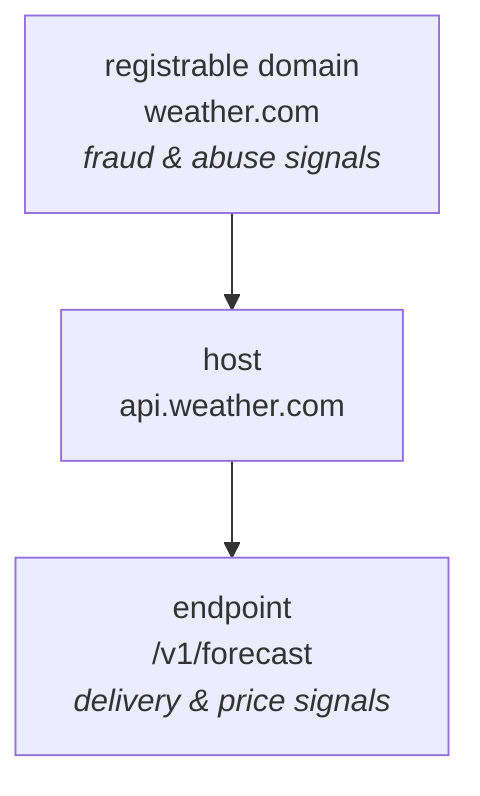
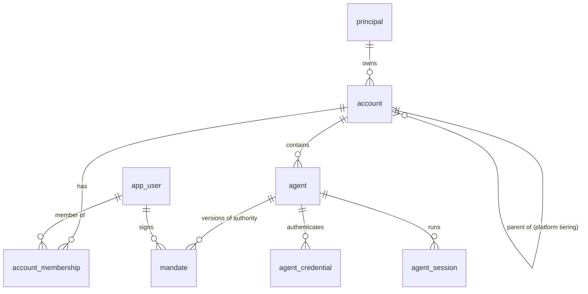
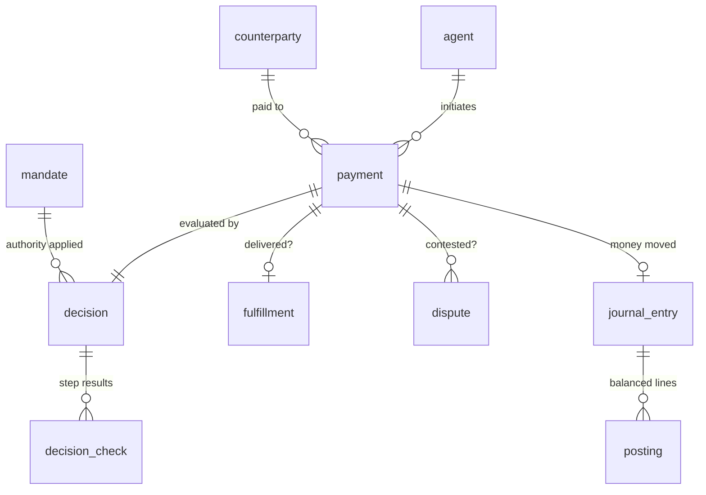

# Data Architecture

**Companion to:** [cleargate-finance-whitepaper.md](cleargate-finance-whitepaper.md)
**Status:** design, pre-implementation
**Audience:** engineering

---

## 0. Why this document exists first

The whitepaper's own thesis is that the payment product is a means, not the end:

> *"Payments is the wedge, not the destination — the payment product exists to collect behavioural truth about machine actors, which is what gets sold, in different forms, to different buyers, for the next decade."* (§13.3)

> *"Instrumenting delivery outcomes from transaction one. **This is architectural, not a later feature.** Without it the product is a rules engine — a three-month build for any competitor."* (§18.3)

That second sentence is a data-schema instruction disguised as strategy. Everything downstream — the reputation bureau, reinsurance, credit, compliance — is gated on possessing records that cannot be reconstructed after the fact.

So this document is written before any table is created, and its organising question is not "what does the MVP need?" but **"what, if we fail to capture it now, is gone forever?"**

---

## 1. What is actually scarce

It is worth being precise about which data is a moat and which is a commodity, because it changes what deserves engineering effort.

| Data | Who else has it | Verdict |
|---|---|---|
| That a payment happened, amount, payee | Anyone in the path; much of it is on-chain | **Commodity** |
| Account and agent configuration | Every competitor will have their own | Commodity |
| **Delivery outcome — did the payee actually deliver** | Almost nobody; requires standing in the transaction | **Scarce** |
| **Declines and holds — the counterfactuals** | Nobody. They exist only here | **Scarce** |
| **The exact inputs a decision was made on** | Nobody, and unreconstructable later | **Scarce** |
| **Loss events with attributed cause** | Nobody. This is the reinsurance key (§7.2 Stage 3) | **Scarce** |

Two consequences follow, and they drive the whole schema:

**(a) The scarce data is the *non-transaction* data.** Approvals are the least interesting rows in the database. §10.1 says this outright — "Transactions are visible on-chain. What exists only inside Cleargate Finance are the declines and holds." A schema that models payments well and declines as an afterthought captures the commodity and loses the moat.

**(b) Outcomes are separate from payments and must be modelled separately.** A payment is an event at one instant. Whether it was *good* is knowable only later — sometimes hours later (delivery), sometimes months (dispute). If outcome is a nullable column on the payment row, you will never be able to ask "what did we know, and when did we know it," which is exactly the question underwriting asks.

---

## 2. The organising principle: recoverability

Sort every candidate field into one of three buckets. This is the single most useful discipline in the document.

### Bucket A — Derivable from data you already store
**Do not store it.** Compute it. Storing it creates two sources of truth that will drift.

Examples: an account's balance (sum of ledger postings), a counterparty's delivery rate (count over fulfillments), lifetime spend per agent.

> *Exception, and it is important:* derived values that sit on the 100ms hot path get a **cache or a maintained counter** — but with a reconciliation job that recomputes from source and alarms on drift. The whitepaper already prescribes exactly this pattern for the ledger: *"An hourly job sums all entries and confirms the total is zero. A non-zero result pages immediately"* (§8.3). Apply the same shape to spend counters.

### Bucket B — Observable again later
**Defer it.** You can backfill.

Examples: a domain's WHOIS record today, a counterparty's current TLS certificate, category market rates.

### Bucket C — Observable *only at this instant*
**Capture it now, unconditionally, even though the MVP does not use it.** This is the bucket that determines whether the company has an asset in three years.

Examples, all from the whitepaper:

- **The mandate version in force at decision time.** §4.3 names this explicitly. Six months later a dispute asks "was this within authority?" If the mandate has been edited since, and you stored only `mandate_id`, you cannot answer, and the guarantee's evidence is worthless.
- **Whether the payee URL came from the agent's original task or appeared mid-session from fetched content.** §6.2 calls this *"the primary tell for injection and SEO-poisoning attacks."* It is knowable only by the SDK, only at request time. It is unrecoverable one millisecond later.
- **Domain age, TLS age, hosting reputation *as they were then*.** A domain that was 3 days old at transaction time is 400 days old when you investigate. The signal is destroyed by the passage of time.
- **The price quoted vs. the category norm at that moment.** Underpins price intelligence (§12) and is a fraud feature.
- **The agent's stated purpose and the task it was given.** Required for the intent check (§6.3) and for the console's causal chain (§10.2).
- **How many novel counterparties this session had already seen.** §6.4 lists "rate of novel merchants per session" as a core feature. It is a function of session state at that instant.

**Practical rule:** Bucket C data goes into an immutable `decision.features` snapshot, written in the same transaction as the decision, and never updated. It costs a few hundred bytes per payment now and is the only possible training set for the supervised models of §6.5 — *"Requires thousands of confirmed loss events."* Those events accumulate at real-world pace; the features must already be waiting for them.

---

## 3. Three data planes

Do not build three systems. Build one Postgres database, structured so that three planes are *distinguishable*, and so the second and third can be physically separated later without a rewrite.



**Plane 1 — System of record.** Normalised, transactional, mutable where it legitimately should be (an account's display name). Correctness-critical.

**Plane 2 — Immutable fact stream.** Append-only. Never UPDATE, never DELETE. This is the asset.

**Plane 3 — Derived.** Scores, baselines, benchmarks. Entirely disposable.

**The governing invariant: Plane 3 must always be fully recomputable from Plane 2.**

This is not architectural purity, it is a commercial requirement with three concrete payoffs:

1. **You will find scoring bugs.** When you do, you re-run the pipeline over history rather than living with a poisoned score forever.
2. **You cannot sell a bureau you cannot explain.** A buyer of reputation data will ask how a score was derived. "It accumulated incrementally over two years and we can't reproduce it" ends the conversation.
3. **Model iteration.** Every improvement to scoring is worth applying retroactively, which requires the raw facts to still be there.

The corollary, which is easy to get wrong: **never let a Plane 3 value be the only record of a Plane 2 fact.** If you increment a counterparty's `total_deliveries` and never store the individual fulfillment rows, you have burned the asset to save a table.

---

## 4. Six schema principles

### 4.1 Snapshot the inputs into the decision, don't reference them

The instinct is normalisation:

```sql
-- WRONG for this domain
CREATE TABLE decision (
  id              uuid PRIMARY KEY,
  mandate_id      uuid REFERENCES mandate(id),       -- mutable target
  counterparty_id uuid REFERENCES counterparty(id),  -- score changes hourly
  outcome         text,
  reason          text
);
```

This is correct database design and wrong product design. Both foreign keys point at rows that change. Reconstructing "why did we approve this?" six months later reads today's mandate and today's score, and produces an answer that was never true.

```sql
-- RIGHT
CREATE TABLE decision (
  id                    uuid PRIMARY KEY,
  payment_id            uuid NOT NULL REFERENCES payment(id),

  -- references, for joins and analytics
  mandate_id            uuid NOT NULL REFERENCES mandate(id),
  counterparty_id       uuid          REFERENCES counterparty(id),

  -- snapshots, for evidence. immutable, authoritative.
  mandate_version       int  NOT NULL,
  mandate_digest        bytea NOT NULL,   -- hash of the signed payload evaluated
  features              jsonb NOT NULL,   -- every input the engine saw

  outcome               text NOT NULL,    -- approved|declined|held|escalated
  reason_code           text NOT NULL,
  ...
);
```

Keep both. The FK serves analytics; the snapshot serves evidence. When they disagree, the snapshot wins, because the snapshot is what actually happened.

### 4.2 Version, never update, anything a decision relied on

Applies to mandates above all. §6.1 requires that a mandate be *"signed by a user with authority, versioned"* and §4.3 that the decision record include *"the mandate version in force at the time."*

Mechanically: `UPDATE mandate SET max_per_tx = ...` is forbidden. Changing rules inserts a new row `(agent_id, version = n+1)` and closes the previous one's validity interval. Enforce it in the database rather than trusting the application:

```sql
CREATE TABLE mandate (
  id              uuid PRIMARY KEY,
  agent_id        uuid NOT NULL REFERENCES agent(id),
  version         int  NOT NULL,
  signed_payload  jsonb NOT NULL,     -- the bytes that were actually signed
  payload_digest  bytea NOT NULL,
  signature       bytea NOT NULL,
  signed_by       uuid NOT NULL REFERENCES app_user(id),
  effective_from  timestamptz NOT NULL,
  effective_to    timestamptz,        -- NULL = currently in force
  UNIQUE (agent_id, version)
);

-- exactly one live version per agent
CREATE UNIQUE INDEX mandate_one_active
  ON mandate (agent_id) WHERE effective_to IS NULL;

-- immutability, enforced by the database, not by discipline
CREATE RULE mandate_no_update AS ON UPDATE TO mandate
  WHERE OLD.effective_to IS NOT NULL DO INSTEAD NOTHING;
```

**Note the denormalisation trap.** You will want `max_per_tx` as a column for querying, but the *signed payload* is the source of truth — it is what the signature covers. Generated columns keep the two from diverging:

```sql
ALTER TABLE mandate ADD COLUMN max_per_tx numeric(38,18)
  GENERATED ALWAYS AS ((signed_payload->>'max_per_tx')::numeric) STORED;
```

Now the queryable column *cannot* disagree with the signed bytes. If you write it by hand instead, one day it will.

### 4.3 Model outcomes as a state machine with explicit terminal states

The naive design:

```sql
-- WRONG
ALTER TABLE payment ADD COLUMN delivered_at timestamptz;  -- NULL = ...what?
```

`NULL` here is overloaded: not yet delivered, never delivered, we stopped waiting, delivered but the webhook was lost. Those are four different facts and the difference between them *is* the loss book.

**Non-events are data.** A payment that was never confirmed is one of the most valuable rows you will ever have, and it is created by *nothing happening*. Nothing-happening does not write a row, so a sweeper must materialise it:

```sql
CREATE TABLE fulfillment (
  id             uuid PRIMARY KEY,
  payment_id     uuid NOT NULL UNIQUE REFERENCES payment(id),
  state          text NOT NULL,  -- pending|confirmed|expired|failed|disputed
  expires_at     timestamptz NOT NULL,
  confirmed_at   timestamptz,
  method         text,           -- payee_callback|schema_check|status_check|timeout
  latency_ms     int,            -- quote -> confirmation. a quality signal.
  evidence       jsonb,
  resolved_at    timestamptz     -- when it reached a terminal state
);
CREATE INDEX fulfillment_sweep ON fulfillment (expires_at) WHERE state = 'pending';
```

A worker moves `pending → expired` at `expires_at`. Every payment therefore reaches a terminal state and is counted. Without the sweeper, your delivery-rate denominator silently excludes exactly the failures you are trying to measure.

`latency_ms` looks incidental and is not: a payee whose confirmation time is drifting upward is degrading before they start failing outright. That is a leading indicator you get free.

### 4.4 Counterparty identity is resolved, not assigned

§4.1 states the requirement precisely:

> *"A counterparty record can exist without an account and later be **linked** to one when that party signs up, inheriting the reputation already accumulated."*

Two schema consequences.

**First, counterparty is not a child of account.** `account_id` is a nullable *claim* on a counterparty, not the counterparty's identity:

```sql
CREATE TABLE counterparty (
  id             uuid PRIMARY KEY,
  canonical_key  text NOT NULL UNIQUE,  -- normalised identity, e.g. "api.weather.com"
  kind           text NOT NULL,         -- endpoint | account
  account_id     uuid REFERENCES account(id),  -- NULL until claimed
  claimed_at     timestamptz,
  first_seen_at  timestamptz NOT NULL
);
```

Get this backwards and on-boarding a merchant orphans their history — the exact opposite of the intended behaviour.

**Second, identity needs a hierarchy.** Is `api.weather.com/v1/forecast` the same counterparty as `api.weather.com/v2/forecast`? For fraud, yes — a bad actor is bad at the domain level. For delivery quality, no — v2 may be broken while v1 is fine.

Model both levels and score at both:



Rule of thumb: **distrust propagates up and back down; trust does not.** §6.2 — *"trust accrues slowly, distrust propagates instantly."* A confirmed non-delivery on one endpoint taints the domain immediately. A thousand good deliveries on `/v1` say nothing about a brand-new `/v3`.

### 4.5 Double-entry, with the naming trap flagged

§8.3 gives the model. The implementation detail that bites: **"account" means two different things** — a customer, and an accounting bucket. Never let them share a name.

```sql
-- accounting bucket. NOT the customer-facing account.
CREATE TABLE ledger_account (
  id          uuid PRIMARY KEY,
  account_id  uuid REFERENCES account(id),  -- NULL for platform-owned buckets
  type        text NOT NULL,  -- customer_funds|payee_payable|revenue|reserve|onchain_float
  asset       text NOT NULL,
  UNIQUE (account_id, type, asset)
);

CREATE TABLE journal_entry (
  id             uuid NOT NULL,
  kind           text NOT NULL,      -- payment|funding|payout|refund|reversal|correction
  reference_type text,
  reference_id   uuid,
  created_at     timestamptz NOT NULL DEFAULT now(),
  PRIMARY KEY (id, created_at)
) PARTITION BY RANGE (created_at);

CREATE TABLE posting (
  id                uuid NOT NULL,
  journal_entry_id  uuid NOT NULL,
  ledger_account_id uuid NOT NULL REFERENCES ledger_account(id),
  amount            numeric(38,18) NOT NULL,  -- signed: +credit / -debit
  asset             text NOT NULL,
  created_at        timestamptz NOT NULL,
  PRIMARY KEY (id, created_at)
) PARTITION BY RANGE (created_at);
```

Three deliberate choices:

- **`numeric`, never `float8`.** `0.1 + 0.2 != 0.3` in binary floating point. A ledger whose defining invariant is "sums to zero" cannot be built on a type that cannot represent its own inputs. Non-negotiable, and it must be mirrored in Go — hence `internal/shared/currency`, which does not accept a `float64`.
- **Signed amounts rather than a `direction` column.** The zero-sum check becomes `SUM(amount) = 0`, which the database can verify directly. A `direction` enum makes it `SUM(CASE WHEN ... )`, which is slower and easier to get wrong.
- **Partitioned by month from day one.** §8.6 anticipates *"an agent paying the same merchant 800 times daily."* Partitioning an empty table is a five-minute job; partitioning a live billion-row table is a migration project. Do it now.

### 4.6 Agents hold counters, not balances

§9.3 is unambiguous and the schema must encode it:

> *"Agents do not hold money. They hold spending authority... The account holds one balance; each agent's mandate carries limits; spending draws from the pool."*

```sql
CREATE TABLE agent_spend_counter (
  agent_id     uuid NOT NULL REFERENCES agent(id),
  period_type  text NOT NULL,          -- day | month
  period_start date NOT NULL,
  spent        numeric(38,18) NOT NULL DEFAULT 0,
  asset        text NOT NULL,
  PRIMARY KEY (agent_id, period_type, period_start, asset)
);
```

Note what is absent: there is **no `balance` column on `agent`**. Adding one rebuilds wallets and inherits every problem §9.3 lists — stranded capital, multiplied key management, miserable reconciliation.

The counter is Bucket A (derivable) but sits on the hot path, so it is maintained *and* reconciled. Authorization checks both levels — `min(agent remaining limit, account balance)` — and a nightly job recomputes counters from postings and alarms on any drift.

---

## 5. The schema

### 5.1 Identity and authority



`account.parent_account_id` is worth adding at MVP even though nothing uses it. §9 — *"Multi-tenancy is designed in from the first commit because retrofitting it is a rewrite."* A nullable self-reference costs nothing today and is the difference between an afternoon and a quarter when the first platform integrator arrives.

`agent_session` groups payments into one agent run. It is what makes "rate of novel counterparties per session" (§6.4) computable and what makes the console's causal chain (§10.2) possible. The SDK must send a session ID; if it does not, sessions cannot be inferred afterwards.

### 5.2 The payment path



The important structural point: **`payment` and `decision` are 1:1 and both exist even when no money moves.** A declined payment still creates a `payment` row and a `decision` row; it simply has no `journal_entry`. This is what makes §10.1 possible — the console's "blocked 14 payments, $3,200 at risk" report is a query, not a special-cased log scrape.

If declines instead go to a log file or a separate `blocked_attempts` table, the product's headline value becomes second-class data. Model them as first-class payments with a non-approving outcome.

### 5.3 The decision record — the asset

```sql
CREATE TABLE decision (
  id               uuid NOT NULL,
  payment_id       uuid NOT NULL,
  account_id       uuid NOT NULL,
  agent_id         uuid NOT NULL,

  outcome          text NOT NULL,   -- approved|declined|held|escalated
  reason_code      text NOT NULL,   -- stable enum, safe to aggregate on
  reason_text      text NOT NULL,   -- human-readable, for the console

  -- evidence snapshot (§4.1)
  mandate_id       uuid NOT NULL,
  mandate_version  int  NOT NULL,
  mandate_digest   bytea NOT NULL,
  features         jsonb NOT NULL,

  evaluated_at     timestamptz NOT NULL,
  latency_ms       int NOT NULL,

  -- tamper evidence (§8.7)
  prev_hash        bytea NOT NULL,
  hash             bytea NOT NULL,
  signature        bytea NOT NULL,

  PRIMARY KEY (id, evaluated_at)
) PARTITION BY RANGE (evaluated_at);
```

Two fields carry more weight than they look like they do.

**`reason_code` separate from `reason_text`.** The code is a stable enum you can aggregate over two years of history; the text is for humans and will be reworded a dozen times. Merge them and every copy edit corrupts your analytics.

**`latency_ms` on every row.** §6.6 makes sub-100ms a hard constraint. Storing the measurement in the same table as the decision means your p99 latency claim is queryable from the system of record rather than dependent on a metrics backend's retention window.

**On `features` being JSONB.** At MVP the feature set is unstable — §6.5's roadmap changes it four times over two years. A JSONB blob absorbs that without migrations. The discipline that keeps it from becoming a swamp: a versioned schema (`features->>'v'`), and promotion of any field that proves durable into a typed generated column. Start flexible, harden what survives.

### 5.4 The loss book

This table is small, boring, and is the thing that eventually unlocks §7.2 Stage 3 reinsurance.

```sql
CREATE TABLE loss_event (
  id             uuid PRIMARY KEY,
  payment_id     uuid NOT NULL REFERENCES payment(id),
  dispute_id     uuid REFERENCES dispute(id),
  category       text NOT NULL,  -- nondelivery|unauthorised|quality|our_error|fraud
  bearer         text NOT NULL,  -- cleargate|payee|payer
  amount         numeric(38,18) NOT NULL,
  root_cause     text,
  recovered      numeric(38,18) NOT NULL DEFAULT 0,
  occurred_at    timestamptz NOT NULL,
  recognised_at  timestamptz NOT NULL   -- when WE learned. not the same date.
);
```

`occurred_at` vs `recognised_at` is the bitemporality that matters commercially. A reinsurer's first question is loss *development* — how long after a transaction do losses surface? With one timestamp you cannot answer, and §7.1's headline metric ("loss rate as a percentage of guaranteed volume") is unanchored in time.

`bearer` matters even at MVP, when the answer is always `payer` because there are no guarantees yet. Recording it from transaction one gives you a clean series when the answer starts changing.

---

## 6. Getting data out: the outbox

You will eventually want events in a warehouse, a queue, or an extracted service. The naive approach dual-writes:

```go
// WRONG — not atomic. A crash between these leaves the two stores disagreeing,
// and you will never know which rows are missing.
tx.Commit()
kafka.Publish(event)
```

The **transactional outbox** removes the distributed-transaction problem entirely:

```sql
CREATE TABLE event_outbox (
  id             bigserial PRIMARY KEY,
  aggregate_type text NOT NULL,
  aggregate_id   uuid NOT NULL,
  event_type     text NOT NULL,
  payload        jsonb NOT NULL,
  occurred_at    timestamptz NOT NULL DEFAULT now(),
  published_at   timestamptz
);
CREATE INDEX outbox_unpublished ON event_outbox (id) WHERE published_at IS NULL;
```

The event row is inserted **in the same transaction** as the state change. A relay in `cmd/worker` reads unpublished rows in order and ships them. If the transaction rolls back, the event never existed. If the relay crashes, it resumes. Delivery is at-least-once, so consumers dedupe on `id`.

Build the table at MVP; build the relay when you have a second consumer. The table is the part that must exist early, because events not written then are events you never had.

---

## 7. Storage roadmap

Resist adding infrastructure. The whitepaper's §8.1 reasoning about microservices applies identically to data stores.

| Stage | Stores | Trigger to move on |
|---|---|---|
| **MVP** | Postgres only. Redis for idempotency + cached scores. | — |
| **~6 months** | + read replica; analytical queries move off primary | Console queries measurably affecting hot-path p99 |
| **~12 months** | + columnar warehouse (ClickHouse/BigQuery), fed by the outbox relay | Aggregations over decisions exceed a few seconds |
| **Year 2+** | + feature store, if supervised models ship | Training/serving skew becomes a real problem |

Two notes.

**Redis holds nothing authoritative.** Idempotency keys and counterparty scores live in Postgres and are *cached* in Redis. Losing Redis must cost latency, never correctness. Idempotency in particular: §8.4 calls a duplicate-payment bug *"the most common way payment systems lose money."* A cache eviction must not be able to cause one, so the durable uniqueness constraint lives in Postgres and Redis is only a fast negative check.

**The warehouse is fed by the outbox, not by replicating Plane 1 tables.** Copying tables couples analytics to your operational schema, so every refactor breaks a dashboard. Events are a contract you version deliberately.

---

## 8. Two obligations that constrain the design

**Right to erasure vs. an immutable log.** GDPR applies (the whitepaper flags EU exposure in §12). An append-only decision log and a deletion request are in direct conflict.

The standard resolution is **crypto-shredding**: personal data lives in one place, encrypted with a per-subject key; everything else references an opaque ID. Erasure destroys the key, rendering the PII unrecoverable while leaving the hash chain intact and the analytics unaffected.

Practically, this means: no email addresses, names or bank details in `decision`, `payment`, `posting` or `event_outbox` — only IDs. That is a cheap rule to follow from the first migration and expensive to retrofit through a hash-chained table.

**Retention differs per plane.** Plane 2 facts are the asset and are kept indefinitely (subject to the above). Plane 3 derived data is disposable. Raw HTTP request logs are neither and should expire in weeks.

---

## 9. Ten decisions to make before the first migration

Ordered by cost-of-being-wrong.

1. **Money type.** `numeric(38,18)` + explicit `asset` column, mirrored by a Go type that refuses `float64`. Irreversible in practice.
2. **Immutability enforcement.** Database-level (rules/triggers/permissions) rather than application discipline. Application discipline fails at 3am.
3. **Mandate versioning.** Insert-only with a validity interval, signed payload authoritative, queryable columns generated from it.
4. **Decision feature snapshot.** JSONB, versioned, written in the payment transaction. The single highest-leverage cheap decision in this document.
5. **Declines are first-class payments**, not a side log.
6. **Counterparty identity independent of account**, with a domain/host/endpoint hierarchy.
7. **Partitioning on `decision` and `posting` from the first migration.**
8. **Spend counters, never agent balances.**
9. **Outbox table from day one**; relay later.
10. **No PII outside a single erasable table.**

Every one of these is nearly free now. Items 1, 3, 4, 5 and 8 are each a multi-month migration if deferred — and items 4 and 5 are not migrations at all, because the data they would have captured no longer exists.
