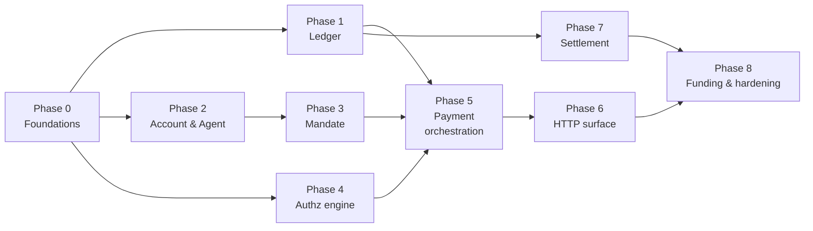

# MVP Implementation Plan

> **For agentic workers:** REQUIRED SUB-SKILL: use `superpowers:subagent-driven-development` (recommended) or `superpowers:executing-plans` to implement this task-by-task. Steps use checkbox (`- [ ]`) syntax for tracking.

**Goal:** An agent owner funds an account, connects an agent with spending rules, that agent pays for things through Cleargate, and the owner sees every payment and every block. (Whitepaper §21)

**Architecture:** One Go monolith, feature-first modules with clean-architecture layers inside each. Gin at the edge, Postgres as the system of record, Redis as a disposable cache. Two binaries — `api` (hot path) and `worker` (everything slow) — built from the same modules.

**Tech stack:** Go 1.26 · Gin · pgx/v5 · shopspring/decimal · golang-migrate · testcontainers-go · Ed25519 · Base/USDC.

**Explicitly out of scope for MVP** (whitepaper §21): guarantees, holds, merchant onboarding, reputation scoring, intent check, behaviour check, agent-to-agent. The pipeline *shape* for those exists; the logic is stubbed.

**Separate repositories:** TypeScript SDK, MCP server, console frontend. This repo owns the API and the contract in `api/openapi.yaml`.

---

## How to read this plan

Each phase ends with something that works and is committed. Each task follows the same rhythm: **write a failing test → watch it fail → minimal implementation → watch it pass → commit.**

Boxes marked **Why this and not that** explain a decision that has a plausible-looking alternative. Read those; they are where the reasoning lives.

---

## Phase ordering, and why it is not the obvious one

The instinct is to build the API endpoint first, because it demos. This plan builds the **ledger** first and the API sixth. Three reasons:

1. **Cost of being wrong.** A ledger bug moves money incorrectly and does so *silently*. A routing bug is a 404 you notice in a minute. Spend the fresh attention on the thing whose failures are invisible.
2. **Dependency direction.** Ledger depends on nothing. Payment depends on everything. Building bottom-up means every phase is testable in isolation the day it is written.
3. **The compiler works for you.** Once `currency.Amount` exists and refuses `float64`, every later phase inherits that safety for free.

The objection — "then we have nothing to show for two weeks" — is answered by Phase 0, which puts a deployable service with a health check in CI on day two. After that each phase is 2–5 days and independently demonstrable.



Phases 2/3 and 4 are independent of Phase 1 — parallelisable if more than one person is working.

---

# Phase 0 — Foundations

**Outcome:** `make dev-up && make run-api` serves `GET /v1/health` against a real Postgres, and `make test-int` runs the same in CI against a throwaway container.

### Task 0.1: Money type

**Files:** `internal/shared/currency/currency.go`, `internal/shared/currency/currency_test.go`

> **Why this and not that — no `float64` constructor**
> `0.1 + 0.2 != 0.3` in IEEE-754. The ledger's defining invariant is that postings sum to exactly zero, so a type that cannot represent its own inputs cannot satisfy it. The protection is not "remember to use decimal" — it is that no function in this package accepts a `float64`, so the mistake does not compile. Whitepaper §8.3 depends on this.

- [ ] **Step 1: Write the failing tests**

```go
// internal/shared/currency/currency_test.go
package currency_test

import (
	"testing"

	"github.com/CleargateFinance/cleargate-core/internal/shared/currency"
)

func TestParse_ExactDecimal(t *testing.T) {
	a, err := currency.Parse("0.40", currency.USDC)
	if err != nil {
		t.Fatalf("Parse: %v", err)
	}
	if got := a.String(); got != "0.4" {
		t.Fatalf("String() = %q, want %q", got, "0.4")
	}
}

func TestAdd_IsExact(t *testing.T) {
	// The canonical float64 failure. This must hold exactly.
	x, _ := currency.Parse("0.1", currency.USDC)
	y, _ := currency.Parse("0.2", currency.USDC)
	sum, err := x.Add(y)
	if err != nil {
		t.Fatalf("Add: %v", err)
	}
	want, _ := currency.Parse("0.3", currency.USDC)
	if !sum.Equal(want) {
		t.Fatalf("0.1 + 0.2 = %s, want 0.3", sum)
	}
}

func TestAdd_RejectsAssetMismatch(t *testing.T) {
	usdc, _ := currency.Parse("1", currency.USDC)
	other, _ := currency.Parse("1", currency.Asset("EURC"))
	if _, err := usdc.Add(other); err == nil {
		t.Fatal("adding across assets must fail")
	}
}

func TestSum_ZeroForBalancedLines(t *testing.T) {
	debit, _ := currency.Parse("-0.40", currency.USDC)
	credit, _ := currency.Parse("0.40", currency.USDC)
	total, err := currency.Sum(currency.USDC, debit, credit)
	if err != nil {
		t.Fatalf("Sum: %v", err)
	}
	if !total.IsZero() {
		t.Fatalf("Sum = %s, want 0", total)
	}
}
```

- [ ] **Step 2: Run and confirm failure**

`go test ./internal/shared/currency/ -run . -v` → FAIL, `undefined: currency.Parse`

- [ ] **Step 3: Implement**

```go
// internal/shared/currency/currency.go
package currency

import (
	"fmt"

	"github.com/shopspring/decimal"
)

type Asset string

const USDC Asset = "USDC"

// Amount is an exact decimal quantity of a specific Asset.
//
// There is deliberately no constructor taking float64. Binary floating point
// cannot represent 0.40, and the ledger invariant is exact equality with zero.
type Amount struct {
	v     decimal.Decimal
	asset Asset
}

func Parse(s string, a Asset) (Amount, error) {
	if a == "" {
		return Amount{}, fmt.Errorf("currency: empty asset")
	}
	d, err := decimal.NewFromString(s)
	if err != nil {
		return Amount{}, fmt.Errorf("currency: parse %q: %w", s, err)
	}
	return Amount{v: d, asset: a}, nil
}

func Zero(a Asset) Amount   { return Amount{v: decimal.Zero, asset: a} }
func (a Amount) Asset() Asset { return a.asset }
func (a Amount) String() string { return a.v.String() }
func (a Amount) IsZero() bool   { return a.v.IsZero() }
func (a Amount) IsNegative() bool { return a.v.IsNegative() }
func (a Amount) Decimal() decimal.Decimal { return a.v }

func (a Amount) Equal(b Amount) bool { return a.asset == b.asset && a.v.Equal(b.v) }

// GreaterThan reports a > b. Callers must pass matching assets; mismatches
// return an error rather than a silently wrong comparison.
func (a Amount) GreaterThan(b Amount) (bool, error) {
	if a.asset != b.asset {
		return false, fmt.Errorf("currency: asset mismatch %s vs %s", a.asset, b.asset)
	}
	return a.v.GreaterThan(b.v), nil
}

func (a Amount) Add(b Amount) (Amount, error) {
	if a.asset != b.asset {
		return Amount{}, fmt.Errorf("currency: asset mismatch %s vs %s", a.asset, b.asset)
	}
	return Amount{v: a.v.Add(b.v), asset: a.asset}, nil
}

func (a Amount) Neg() Amount { return Amount{v: a.v.Neg(), asset: a.asset} }

func Sum(asset Asset, amounts ...Amount) (Amount, error) {
	total := Zero(asset)
	for _, x := range amounts {
		var err error
		if total, err = total.Add(x); err != nil {
			return Amount{}, err
		}
	}
	return total, nil
}
```

- [ ] **Step 4: Verify** — `go test ./internal/shared/currency/ -v` → PASS (4 tests)

- [ ] **Step 5: Commit**

```bash
go get github.com/shopspring/decimal
git add internal/shared/currency go.mod go.sum
git commit -m "feat(currency): exact decimal amount type with asset safety"
```

### Task 0.2: Config, Postgres pool, unit of work

**Files:** `internal/platform/config/config.go`, `internal/platform/postgres/postgres.go`, `internal/platform/postgres/unitofwork.go`

> **Why this and not that — the unit of work takes a `context.Context`, not a `*sql.Tx`**
> Repositories need to run inside a caller-controlled transaction, but a repository method signature must not leak the transaction type — that would force every module to import pgx and would break the dependency rule. Stashing the transaction in the context means `Post(ctx, ...)` joins whatever transaction is open, and works identically outside one. One signature, both cases.

- [ ] **Step 1: Failing test** (`internal/platform/postgres/unitofwork_test.go`)

```go
//go:build integration

package postgres_test

import (
	"context"
	"errors"
	"testing"

	"github.com/CleargateFinance/cleargate-core/test/fixtures"
)

func TestUnitOfWork_RollsBackOnError(t *testing.T) {
	ctx := context.Background()
	db := fixtures.NewTestDB(t) // spins Postgres via testcontainers, runs migrations

	_, err := db.Pool.Exec(ctx, `CREATE TABLE uow_probe (id int PRIMARY KEY)`)
	if err != nil {
		t.Fatal(err)
	}

	sentinel := errors.New("boom")
	err = db.UoW.Do(ctx, func(ctx context.Context) error {
		if _, err := db.Exec(ctx, `INSERT INTO uow_probe (id) VALUES (1)`); err != nil {
			return err
		}
		return sentinel
	})
	if !errors.Is(err, sentinel) {
		t.Fatalf("err = %v, want %v", err, sentinel)
	}

	var n int
	if err := db.Pool.QueryRow(ctx, `SELECT count(*) FROM uow_probe`).Scan(&n); err != nil {
		t.Fatal(err)
	}
	if n != 0 {
		t.Fatalf("rows = %d after rollback, want 0", n)
	}
}
```

- [ ] **Step 2: Confirm failure** — `go test ./internal/platform/postgres/ -tags=integration -v` → FAIL (undefined fixtures)

- [ ] **Step 3: Implement the DB handle and UoW**

```go
// internal/platform/postgres/postgres.go
package postgres

import (
	"context"

	"github.com/jackc/pgx/v5"
	"github.com/jackc/pgx/v5/pgxpool"
)

type ctxKey struct{}

// DB is what repositories receive. Exec/Query transparently use the ambient
// transaction if one is open on the context, otherwise the pool.
type DB struct {
	Pool *pgxpool.Pool
	UoW  UnitOfWork
}

type querier interface {
	Exec(context.Context, string, ...any) (pgconnCommandTag, error)
	Query(context.Context, string, ...any) (pgx.Rows, error)
	QueryRow(context.Context, string, ...any) pgx.Row
}

func (d *DB) q(ctx context.Context) pgx.Tx { // nil means "use pool"
	if tx, ok := ctx.Value(ctxKey{}).(pgx.Tx); ok {
		return tx
	}
	return nil
}
```

> Fill in `Exec`/`Query`/`QueryRow` delegating to `d.q(ctx)` when non-nil, else `d.Pool`. Keep this file under ~120 lines; it is plumbing.

```go
// internal/platform/postgres/unitofwork.go
package postgres

import (
	"context"
	"fmt"

	"github.com/jackc/pgx/v5"
	"github.com/jackc/pgx/v5/pgxpool"
)

type UnitOfWork interface {
	Do(ctx context.Context, fn func(ctx context.Context) error) error
}

type uow struct{ pool *pgxpool.Pool }

func NewUnitOfWork(pool *pgxpool.Pool) UnitOfWork { return &uow{pool: pool} }

func (u *uow) Do(ctx context.Context, fn func(context.Context) error) error {
	// Nested calls join the outer transaction rather than opening a second one.
	if _, ok := ctx.Value(ctxKey{}).(pgx.Tx); ok {
		return fn(ctx)
	}
	tx, err := u.pool.Begin(ctx)
	if err != nil {
		return fmt.Errorf("begin: %w", err)
	}
	defer func() { _ = tx.Rollback(ctx) }() // no-op after a successful commit

	if err := fn(context.WithValue(ctx, ctxKey{}, tx)); err != nil {
		return err
	}
	return tx.Commit(ctx)
}
```

- [ ] **Step 4: Build the test fixture** (`test/fixtures/db.go`)

```go
package fixtures

import (
	"context"
	"testing"

	"github.com/testcontainers/testcontainers-go/modules/postgres"
)

// NewTestDB starts a real Postgres, applies ./migrations, and returns a handle.
// Container lifetime is bound to the test via t.Cleanup.
func NewTestDB(t *testing.T) *TestDB {
	t.Helper()
	// TODO: postgres.Run(ctx, "postgres:17-alpine", ...); migrate up; return handle.
	panic("implement")
}
```

> **Why this and not that — a real container, not `sqlmock`**
> Most of the ledger's correctness lives in *database* constructs: the zero-sum constraint, the partial unique index enforcing one live mandate, generated columns keeping signed and queryable data in sync. `sqlmock` tests your Go against an imaginary database — it would pass while production is broken. Containers cost ~3 seconds per package and test the thing that actually enforces the invariant.

- [ ] **Step 5: Verify and commit**

```bash
go test ./internal/platform/postgres/ -tags=integration -v   # PASS
git add internal/platform test/fixtures go.mod go.sum
git commit -m "feat(platform): postgres pool, context-scoped unit of work, test harness"
```

### Task 0.3: Migration tooling and the walking skeleton

- [ ] **Step 1:** `cmd/migrate` wrapping `golang-migrate`, subcommands `up`/`down`/`version`.
- [ ] **Step 2:** `migrations/000001_extensions.up.sql` — `CREATE EXTENSION IF NOT EXISTS pgcrypto;`
- [ ] **Step 3:** `internal/platform/httpx` — Gin engine with request-ID, structured logging, panic recovery, and the single `apperr.Kind → HTTP status` mapper.
- [ ] **Step 4:** `internal/app/api.go` — `BuildAPI(cfg) (*gin.Engine, func(), error)` registering only `GET /v1/health` (checks DB and Redis).
- [ ] **Step 5:** `cmd/api/main.go` — graceful shutdown as sketched in the scaffold.

> **Why this and not that — migrations never run on API boot**
> A rolling deploy starts several instances at once. If each runs migrations, they race on the same DDL and one wins arbitrarily. `cmd/migrate` runs as an explicit deploy step, before the new version starts.

- [ ] **Step 6: E2E test and commit**

```go
// test/e2e/health_test.go — asserts 200 and {"status":"ok"} from a fully built app
```

```bash
git commit -m "feat: walking skeleton — migrations, gin bootstrap, health endpoint"
```

**Phase 0 done when:** CI runs unit + integration tests green, and `make run-api` answers `/v1/health`.

---

# Phase 1 — Ledger

**Outcome:** money can be recorded correctly. Unbalanced entries are impossible. Balances and spend counters are derivable and reconciled.

### Task 1.1: Schema

**Files:** `migrations/000002_ledger.up.sql` / `.down.sql`

- [ ] **Step 1: Write the migration**

```sql
CREATE TABLE ledger_account (
  id          uuid PRIMARY KEY DEFAULT gen_random_uuid(),
  account_id  uuid,                       -- NULL for platform-owned buckets
  type        text NOT NULL CHECK (type IN
                ('customer_funds','payee_payable','revenue','reserve','onchain_float')),
  asset       text NOT NULL,
  created_at  timestamptz NOT NULL DEFAULT now(),
  UNIQUE (account_id, type, asset)
);

CREATE TABLE journal_entry (
  id             uuid NOT NULL DEFAULT gen_random_uuid(),
  kind           text NOT NULL CHECK (kind IN
                   ('payment','funding','payout','refund','reversal','correction')),
  reference_type text,
  reference_id   uuid,
  description    text,
  created_at     timestamptz NOT NULL DEFAULT now(),
  PRIMARY KEY (id, created_at)
) PARTITION BY RANGE (created_at);

CREATE TABLE posting (
  id                uuid NOT NULL DEFAULT gen_random_uuid(),
  journal_entry_id  uuid NOT NULL,
  ledger_account_id uuid NOT NULL REFERENCES ledger_account(id),
  amount            numeric(38,18) NOT NULL,   -- signed: negative debit, positive credit
  asset             text NOT NULL,
  created_at        timestamptz NOT NULL,
  PRIMARY KEY (id, created_at)
) PARTITION BY RANGE (created_at);

CREATE INDEX posting_by_account ON posting (ledger_account_id, created_at DESC);
CREATE INDEX posting_by_entry   ON posting (journal_entry_id);

-- Append-only. Corrections are reversing entries (whitepaper §8.3).
CREATE RULE posting_no_update AS ON UPDATE TO posting DO INSTEAD NOTHING;
CREATE RULE posting_no_delete AS ON DELETE TO posting DO INSTEAD NOTHING;

-- Initial partitions; the worker creates future ones ahead of time.
CREATE TABLE journal_entry_2026m09 PARTITION OF journal_entry
  FOR VALUES FROM ('2026-09-01') TO ('2026-10-01');
CREATE TABLE posting_2026m09 PARTITION OF posting
  FOR VALUES FROM ('2026-09-01') TO ('2026-10-01');
```

- [ ] **Step 2: Add the zero-sum constraint**

```sql
-- Deferred to COMMIT so postings can be inserted one at a time inside a
-- transaction and are only judged as a complete entry.
CREATE OR REPLACE FUNCTION assert_entry_balanced() RETURNS trigger AS $$
DECLARE total numeric(38,18);
BEGIN
  SELECT COALESCE(SUM(amount), 0) INTO total
    FROM posting WHERE journal_entry_id = NEW.journal_entry_id;
  IF total <> 0 THEN
    RAISE EXCEPTION 'journal entry % is unbalanced: sums to %',
      NEW.journal_entry_id, total;
  END IF;
  RETURN NULL;
END; $$ LANGUAGE plpgsql;

CREATE CONSTRAINT TRIGGER posting_balanced
  AFTER INSERT ON posting
  DEFERRABLE INITIALLY DEFERRED
  FOR EACH ROW EXECUTE FUNCTION assert_entry_balanced();
```

> **Why this and not that — enforce in the database, not in Go**
> Application-level validation protects only the paths that remember to call it. Backfills, admin scripts, a future service and a 3am hotfix all bypass it. The constraint is the last line that cannot be bypassed. Go validates too — for a good error message — but the database is what makes the invariant true.

> **Why signed amounts rather than a `direction` column**
> The invariant becomes `SUM(amount) = 0`, which the trigger checks directly. A `direction` enum turns it into `SUM(CASE WHEN direction='debit' THEN -amount ELSE amount END)`, which is slower, harder to index, and easy to get backwards.

- [ ] **Step 3: Test the constraint fires**

```go
//go:build integration
func TestLedger_UnbalancedEntryRejectedByDatabase(t *testing.T) {
	// Insert a single posting of +5 with no counter-posting, commit, expect error.
	// Asserts the DATABASE rejects it, independent of any Go validation.
}
```

- [ ] **Step 4: Verify → PASS. Step 5: Commit** `feat(ledger): schema with database-enforced zero-sum invariant`

### Task 1.2: Post and Balance

**Files:** `internal/modules/ledger/{domain,service,ports,repo_postgres}.go` + tests

- [ ] **Step 1: Failing tests**

```go
func TestPost_RejectsUnbalancedLines(t *testing.T)     // Go-level check, clear error
func TestPost_WritesEntryAndPostings(t *testing.T)
func TestBalance_SumsPostings(t *testing.T)
func TestPost_IsAtomicWithCallerTransaction(t *testing.T) // rollback removes the entry
```

- [ ] **Step 2: Confirm failure. Step 3: Implement**

```go
// internal/modules/ledger/domain.go
package ledger

type Line struct {
	LedgerAccountID id.LedgerAccountID
	Amount          currency.Amount // signed
}

// Balanced reports whether the lines form a valid double-entry transaction.
func Balanced(asset currency.Asset, lines []Line) (bool, error) {
	amounts := make([]currency.Amount, 0, len(lines))
	for _, l := range lines {
		amounts = append(amounts, l.Amount)
	}
	total, err := currency.Sum(asset, amounts...)
	if err != nil {
		return false, err
	}
	return total.IsZero(), nil
}
```

```go
// internal/modules/ledger/service.go
func (s *Service) Post(ctx context.Context, e Entry) (id.JournalEntryID, error) {
	ok, err := Balanced(e.Asset, e.Lines)
	if err != nil {
		return "", err
	}
	if !ok {
		return "", apperr.Invalid("ledger: entry does not sum to zero")
	}
	return s.repo.Insert(ctx, e) // joins the caller's transaction via ctx
}
```

- [ ] **Step 4: Verify. Step 5: Commit** `feat(ledger): post balanced entries, derive balances`

### Task 1.3: Spend counters

**Files:** `migrations/000003_spend_counters.up.sql`, `internal/modules/ledger/counter.go`

> **Why this and not that — a counter, never a balance on `agent`**
> Whitepaper §9.3: *"Agents do not hold money. They hold spending authority."* Giving an agent a balance rebuilds per-agent wallets and inherits stranded capital, multiplied key management, and painful reconciliation. The counter is a meter that enforces a cap; the money stays pooled at the account. This is the corporate-card model.
>
> The counter is technically derivable from postings, but deriving it costs a scan on the 100ms path — so it is *maintained* and *reconciled* nightly, the same pattern §8.3 prescribes for the ledger itself.

- [ ] **Step 1: Failing tests**

```go
func TestIncrementSpend_CreatesPeriodRowOnFirstSpend(t *testing.T)
func TestIncrementSpend_IsAtomicUnderConcurrency(t *testing.T) // 50 goroutines x $1 == $50
func TestReconcile_DetectsDrift(t *testing.T)
```

- [ ] **Step 2–4: Implement with an atomic upsert**

```sql
INSERT INTO agent_spend_counter (agent_id, period_type, period_start, asset, spent)
VALUES ($1, $2, $3, $4, $5)
ON CONFLICT (agent_id, period_type, period_start, asset)
DO UPDATE SET spent = agent_spend_counter.spent + EXCLUDED.spent
RETURNING spent;
```

> **Why this and not that — upsert rather than read-modify-write**
> Whitepaper §8.5 describes the exact bug: two concurrent requests both read the same remaining balance and both approve. A read in Go followed by a write is that bug. The single atomic statement makes the increment indivisible, and returning the new total lets the caller detect a cap breach *after* the fact within the same transaction, then roll back.

- [ ] **Step 5: Commit** `feat(ledger): per-agent spend counters with atomic increment`

### Task 1.4: Reconciliation job

- [ ] Worker job, hourly: `SELECT SUM(amount) FROM posting` must be `0`; non-zero pages immediately (§8.3).
- [ ] Nightly: recompute counters from postings, alarm on drift.
- [ ] Test: inject an imbalance in a test DB, assert the job reports it.
- [ ] Commit `feat(worker): ledger zero-sum and counter reconciliation`

**Phase 1 done when:** an unbalanced entry cannot be committed by any path, and the reconciliation job proves the book balances.

---

# Phase 2 — Account and agent

**Outcome:** the entity model of §4.1 exists, agents authenticate, revocation is instant.

### Task 2.1: Schema

**Files:** `migrations/000004_identity.up.sql`

```sql
CREATE TABLE principal (
  id uuid PRIMARY KEY DEFAULT gen_random_uuid(),
  kind text NOT NULL CHECK (kind IN ('person','legal_entity')),
  created_at timestamptz NOT NULL DEFAULT now()
);

-- All PII lives here and nowhere else, so erasure is a single-row delete
-- (data-architecture.md §8). No other table stores a name or an email.
CREATE TABLE principal_identity (
  principal_id uuid PRIMARY KEY REFERENCES principal(id),
  legal_name   text,
  email        text,
  country      text,
  kyc_status   text NOT NULL DEFAULT 'none',
  erased_at    timestamptz
);

CREATE TABLE account (
  id                uuid PRIMARY KEY DEFAULT gen_random_uuid(),
  principal_id      uuid NOT NULL REFERENCES principal(id),
  parent_account_id uuid REFERENCES account(id),   -- platform tiering (§9)
  display_name      text NOT NULL,
  status            text NOT NULL DEFAULT 'active',
  created_at        timestamptz NOT NULL DEFAULT now()
);

CREATE TABLE app_user (
  id uuid PRIMARY KEY DEFAULT gen_random_uuid(),
  principal_id uuid REFERENCES principal(id),
  created_at timestamptz NOT NULL DEFAULT now()
);

CREATE TABLE account_membership (
  account_id uuid NOT NULL REFERENCES account(id),
  user_id    uuid NOT NULL REFERENCES app_user(id),
  role       text NOT NULL CHECK (role IN ('owner','admin','approver','viewer')),
  PRIMARY KEY (account_id, user_id)
);

CREATE TABLE agent (
  id         uuid PRIMARY KEY DEFAULT gen_random_uuid(),
  account_id uuid NOT NULL REFERENCES account(id),
  name       text NOT NULL,
  status     text NOT NULL DEFAULT 'active',
  created_at timestamptz NOT NULL DEFAULT now(),
  revoked_at timestamptz
);

CREATE TABLE agent_credential (
  id          uuid PRIMARY KEY DEFAULT gen_random_uuid(),
  agent_id    uuid NOT NULL REFERENCES agent(id),
  prefix      text NOT NULL UNIQUE,   -- lookup key, safe to log
  secret_hash bytea NOT NULL,         -- argon2id
  created_at  timestamptz NOT NULL DEFAULT now(),
  revoked_at  timestamptz,
  last_used_at timestamptz
);

-- Groups payments into one agent run. Required for the per-session features of
-- §6.4 and the causal chain of §10.2. Cannot be inferred retroactively.
CREATE TABLE agent_session (
  id         uuid PRIMARY KEY DEFAULT gen_random_uuid(),
  agent_id   uuid NOT NULL REFERENCES agent(id),
  task_ref   text,
  task_text  text,
  started_at timestamptz NOT NULL DEFAULT now()
);
```

> **Why `parent_account_id` now, when nothing uses it**
> §9: *"Multi-tenancy is designed in from the first commit because retrofitting it is a rewrite."* A nullable self-reference costs one column today. Adding it later means backfilling every account, rewriting every authorization query to be hierarchy-aware, and re-testing the whole permission model.

> **Why `agent_session` now, when the MVP has no behaviour check**
> Same argument, sharper: session membership is knowable *only* at request time. If the SDK does not send a session ID from day one, the data for §6.4's "rate of novel merchants per session" is not late — it never existed.

### Task 2.2: Credential issue and verify

- [ ] **Tests:** `TestIssueCredential_ReturnsSecretOnlyOnce`, `TestVerify_RejectsRevoked`, `TestVerify_ConstantTimeOnMismatch`
- [ ] Format: `cg_live_<prefix>_<secret>`. Store `argon2id(secret)`; the prefix is the index.

> **Why a prefix plus a hash rather than hashing the whole key**
> You need an indexed lookup, and you cannot index a salted hash. The prefix is a non-secret handle that finds one row; the hash then verifies the secret. It is also safe in logs, which means a support engineer can identify a credential without ever seeing it. Argon2id over SHA-256 because these are secrets an attacker could brute-force offline.

- [ ] Commit `feat(account): entity model, agent credentials, sessions`

---

# Phase 3 — Mandate

**Outcome:** spending authority is signed, versioned and verifiable — the control that makes §6.1 true.

### Task 3.1: Canonical payload and signing

> **Why this and not that — sign stored bytes, never a re-marshalled struct**
> The classic bug: sign `json.Marshal(rules)`, store the struct, later re-marshal to verify. Go map iteration order and future field additions produce *different bytes*, so the signature fails to verify and your evidence is worthless — discovered during a dispute, which is the worst possible moment.
> The fix is to treat the signed payload as opaque bytes: canonicalise once (RFC 8785 JCS), sign, store the exact bytes, and verify against those bytes forever. The typed rules are parsed *from* the payload, never back into it.

- [ ] **Step 1: Failing tests**

```go
func TestCanonicalise_IsStableAcrossMarshals(t *testing.T) // same input, byte-identical 100x
func TestSignAndVerify_RoundTrips(t *testing.T)
func TestVerify_FailsOnAnyMutation(t *testing.T)          // flip one byte -> reject
func TestVerify_FailsOnWrongKey(t *testing.T)
```

- [ ] **Step 3: Implement** — Ed25519 in `internal/platform/crypto`.

> **Why Ed25519 over ECDSA:** deterministic (no nonce to reuse and leak a key), fixed 64-byte signatures, no curve or parameter choices to get wrong, and constant-time by construction in Go's stdlib.

### Task 3.2: Versioned storage

```sql
CREATE TABLE mandate (
  id             uuid PRIMARY KEY DEFAULT gen_random_uuid(),
  agent_id       uuid NOT NULL REFERENCES agent(id),
  version        int  NOT NULL,
  signed_payload jsonb NOT NULL,
  payload_digest bytea NOT NULL,
  signature      bytea NOT NULL,
  signed_by      uuid NOT NULL REFERENCES app_user(id),
  effective_from timestamptz NOT NULL DEFAULT now(),
  effective_to   timestamptz,
  created_at     timestamptz NOT NULL DEFAULT now(),

  -- Queryable projections, GENERATED from the signed bytes so they cannot
  -- drift from what was actually signed.
  max_per_tx    numeric(38,18) GENERATED ALWAYS AS ((signed_payload->>'max_per_tx')::numeric)    STORED,
  max_per_day   numeric(38,18) GENERATED ALWAYS AS ((signed_payload->>'max_per_day')::numeric)   STORED,
  max_per_month numeric(38,18) GENERATED ALWAYS AS ((signed_payload->>'max_per_month')::numeric) STORED,

  UNIQUE (agent_id, version)
);

CREATE UNIQUE INDEX mandate_one_active ON mandate (agent_id) WHERE effective_to IS NULL;
```

> **Why generated columns and not application-written ones**
> You need `max_per_tx` as a column for queries and reporting, but the signed payload is the source of truth. If the application writes both, one day a code path updates one and not the other, and the number the console shows is not the number that was enforced. `GENERATED ALWAYS ... STORED` makes divergence impossible at the database level.

> **Why the partial unique index**
> "Exactly one live mandate per agent" is an invariant the authorization path depends on. Expressed as an index, a bug that tries to create a second one fails loudly at write time instead of silently making `ORDER BY version DESC LIMIT 1` the only thing standing between you and enforcing the wrong rules.

- [ ] **Tests:** `TestIssue_SupersedesPrevious`, `TestOnlyOneActiveVersion`, `TestActiveAt_ReturnsHistoricalVersion` (the dispute query), `TestUpdate_IsRejected`
- [ ] Commit `feat(mandate): signed, versioned, immutable spending authority`

---

# Phase 4 — Authorization engine

**Outcome:** the decision function, pure and exhaustively table-tested.

### Task 4.1: The pure Decide function

> **Why this and not that — the signature has no `context.Context` and no `error`**
> This is not a style preference; it is the latency constraint made mechanical. §6.6: *"Nothing slow runs in the request path: no chain calls, no model inference, no external HTTP."* A function that takes no context and returns no error **cannot perform I/O** — there is no way to express a network call in that signature. The compiler enforces the rule that would otherwise rely on code review forever.
>
> The second payoff is evidential. §7.1 says most disputes should become *"a lookup, not a debate."* A pure function is a table of inputs and expected outputs, which is exactly what you show an auditor and exactly what a regression test looks like.
>
> The cost — every input must be fetched before calling — is a feature: it makes the engine's data dependencies explicit and reviewable in one struct.

- [ ] **Step 1: Failing table test**

```go
// internal/modules/authz/engine_test.go
func TestDecide(t *testing.T) {
	usd := func(s string) currency.Amount { a, _ := currency.Parse(s, currency.USDC); return a }

	base := authz.Snapshot{
		Rules: authz.Rules{
			MaxPerTx:    usd("20"),
			MaxPerDay:   usd("100"),
			MaxPerMonth: usd("200"),
			Categories:  []string{"data_api", "inference"},
			ExpiresAt:   time.Date(2027, 1, 1, 0, 0, 0, 0, time.UTC),
		},
		DaySpent:       usd("12.40"),
		MonthSpent:     usd("54.00"),
		AccountBalance: usd("500"),
		Now:            time.Date(2026, 9, 1, 14, 31, 0, 0, time.UTC),
	}

	cases := []struct {
		name    string
		req     authz.Request
		mutate  func(*authz.Snapshot)
		outcome authz.Outcome
		reason  authz.ReasonCode
	}{
		{
			name:    "within all limits is approved",
			req:     authz.Request{Amount: usd("0.40"), Category: "data_api"},
			outcome: authz.Approved,
			reason:  authz.ReasonOK,
		},
		{
			// The whitepaper's own dashboard example, §5.1
			name:    "over per-transaction cap is declined",
			req:     authz.Request{Amount: usd("85"), Category: "data_api"},
			outcome: authz.Declined,
			reason:  authz.ReasonOverPerTxCap,
		},
		{
			name:    "category not permitted is declined",
			req:     authz.Request{Amount: usd("1"), Category: "gambling"},
			outcome: authz.Declined,
			reason:  authz.ReasonCategoryNotPermitted,
		},
		{
			name:    "would breach daily cap is declined",
			req:     authz.Request{Amount: usd("19"), Category: "data_api"},
			mutate:  func(s *authz.Snapshot) { s.DaySpent = usd("95") },
			outcome: authz.Declined,
			reason:  authz.ReasonOverDailyCap,
		},
		{
			name:    "insufficient account balance is declined",
			req:     authz.Request{Amount: usd("10"), Category: "data_api"},
			mutate:  func(s *authz.Snapshot) { s.AccountBalance = usd("5") },
			outcome: authz.Declined,
			reason:  authz.ReasonInsufficientFunds,
		},
		{
			name:    "expired mandate is declined",
			req:     authz.Request{Amount: usd("1"), Category: "data_api"},
			mutate:  func(s *authz.Snapshot) { s.Rules.ExpiresAt = s.Now.Add(-time.Hour) },
			outcome: authz.Declined,
			reason:  authz.ReasonMandateExpired,
		},
		{
			name:    "exactly at the cap is approved",
			req:     authz.Request{Amount: usd("20"), Category: "data_api"},
			outcome: authz.Approved,
			reason:  authz.ReasonOK,
		},
		{
			name:    "zero amount is invalid",
			req:     authz.Request{Amount: usd("0"), Category: "data_api"},
			outcome: authz.Declined,
			reason:  authz.ReasonInvalidAmount,
		},
		{
			name:    "negative amount is invalid",
			req:     authz.Request{Amount: usd("-5"), Category: "data_api"},
			outcome: authz.Declined,
			reason:  authz.ReasonInvalidAmount,
		},
	}

	for _, tc := range cases {
		t.Run(tc.name, func(t *testing.T) {
			snap := base
			if tc.mutate != nil {
				tc.mutate(&snap)
			}
			got := authz.Decide(tc.req, snap)
			if got.Outcome != tc.outcome || got.ReasonCode != tc.reason {
				t.Fatalf("got (%v, %v), want (%v, %v)",
					got.Outcome, got.ReasonCode, tc.outcome, tc.reason)
			}
		})
	}
}
```

- [ ] **Step 2: Confirm failure. Step 3: Implement**

```go
// internal/modules/authz/engine.go
package authz

// Decide evaluates a payment request against pre-fetched state.
//
// PURE BY CONTRACT: no context, no error, no I/O. Every input arrives in
// Snapshot. See doc.go for why.
func Decide(req Request, s Snapshot) Decision {
	d := Decision{Features: buildFeatures(req, s)}

	if req.Amount.IsZero() || req.Amount.IsNegative() {
		return d.decline(ReasonInvalidAmount, "amount must be positive")
	}
	if s.Now.After(s.Rules.ExpiresAt) {
		return d.decline(ReasonMandateExpired, "mandate expired")
	}
	if !s.Rules.PermitsCategory(req.Category) {
		return d.decline(ReasonCategoryNotPermitted,
			"category "+req.Category+" not permitted by mandate")
	}
	if over, _ := req.Amount.GreaterThan(s.Rules.MaxPerTx); over {
		return d.decline(ReasonOverPerTxCap,
			"over "+s.Rules.MaxPerTx.String()+" per-transaction limit")
	}
	if projected, err := s.DaySpent.Add(req.Amount); err == nil {
		if over, _ := projected.GreaterThan(s.Rules.MaxPerDay); over {
			return d.decline(ReasonOverDailyCap, "would exceed daily limit")
		}
	}
	if projected, err := s.MonthSpent.Add(req.Amount); err == nil {
		if over, _ := projected.GreaterThan(s.Rules.MaxPerMonth); over {
			return d.decline(ReasonOverMonthlyCap, "would exceed monthly limit")
		}
	}
	if over, _ := req.Amount.GreaterThan(s.AccountBalance); over {
		return d.decline(ReasonInsufficientFunds, "insufficient account balance")
	}

	// MVP: counterparty, intent and behaviour checks are stubs that pass.
	// The call sites exist so adding them later is an edit, not a redesign.
	return d.approve()
}
```

> **Why stub the three unbuilt checks rather than omit them**
> §21 scopes MVP to the mandate check. But §6's pipeline is the product's shape. Leaving the call sites in place — each returning `Pass` and recording a `decision_check` row — means Phase 2 of the detection roadmap (§6.5) is a function body, and the decision record already has the right structure for the day it is filled in.

- [ ] **Step 4: Verify** — 9 subtests pass.
- [ ] **Step 5: Commit** `feat(authz): pure mandate-check decision engine`

### Task 4.2: Feature snapshot

- [ ] `buildFeatures` returns versioned JSONB capturing every input, plus the Bucket-C fields from the request: URL provenance, stated purpose, session novel-counterparty count, quoted price.
- [ ] **Test:** `TestFeatures_CapturesAllDecisionInputs` — asserts the snapshot is sufficient to replay the decision.

> **Why:** data-architecture.md §2, Bucket C. These fields are unrecoverable after the instant passes and are the only possible training data for §6.5's year-2 models. Cost now: a few hundred bytes per payment.

- [ ] Commit `feat(authz): immutable decision feature snapshot`

---

# Phase 5 — Payment orchestration

**Outcome:** the atomic core. This is the task where the monolith decision pays for itself.

### Task 5.1: Payment and decision schema

**Files:** `migrations/000006_payment.up.sql` — `payment`, `decision` (partitioned, hash-chained), `decision_check`, `idempotency_key`, `event_outbox`, `fulfillment`.

Schema per [data-architecture.md](data-architecture.md) §5.3.

> **Why declines get a full `payment` row**
> §10.1: *"What exists only inside Cleargate Finance are the declines and holds — and those are the proof of value."* If blocked attempts go to a log line or a side table, the console's headline report ("blocked 14 payments, $3,200 at risk") becomes a log-scraping exercise instead of a `SELECT`. Model them as first-class payments with a non-approving outcome.

### Task 5.2: Idempotency

- [ ] **Tests:** `TestAuthorize_ReplayReturnsOriginalResult`, `TestAuthorize_ConcurrentSameKeyChargesOnce`, `TestAuthorize_DifferentKeySameParamsChargesTwice`

```sql
CREATE TABLE idempotency_key (
  account_id  uuid NOT NULL REFERENCES account(id),
  key         text NOT NULL,
  request_hash bytea NOT NULL,
  payment_id  uuid,
  response    jsonb,
  created_at  timestamptz NOT NULL DEFAULT now(),
  PRIMARY KEY (account_id, key)
);
```

> **Why the durable constraint is in Postgres and Redis is only a fast path**
> §8.4: *"Without this, a timeout inside a retry loop produces thousands of duplicate payments in minutes with no attacker involved. This is the most common way payment systems lose money."*
> Redis evicts under memory pressure and can be flushed by an operator. If it were the only guard, a cache miss would authorise a duplicate payment. The primary key on `(account_id, key)` makes duplicates impossible even with every cache cold; Redis exists only to avoid a database round-trip on the common miss.

> **Why the request hash is stored**
> If a client reuses a key with different parameters, that is a client bug, and silently returning the old result hides it. Compare the hash; on mismatch return `409 Conflict`. This is standard practice (Stripe behaves this way) and turns a silent data corruption into a loud integration error.

### Task 5.3: The transaction boundary

- [ ] **Step 1: Failing test** — the one that justifies the whole architecture:

```go
//go:build integration

// If the decision record cannot be written, the money must not move.
// This is the state the guarantee cannot survive: a payment with no evidence
// behind it. In a microservice split this test is not expressible without a
// saga; here it is a rollback.
func TestAuthorize_LedgerAndDecisionAreAtomic(t *testing.T) {
	db := fixtures.NewTestDB(t)
	svc := fixtures.NewPaymentService(t, db,
		fixtures.WithFailingDecisionLog(errors.New("disk full")))

	_, err := svc.Authorize(ctx, validRequest)
	if err == nil {
		t.Fatal("expected failure")
	}

	bal := fixtures.AccountBalance(t, db, accountID)
	if !bal.Equal(startingBalance) {
		t.Fatalf("balance = %s after failed authorize, want unchanged %s",
			bal, startingBalance)
	}
	fixtures.AssertNoPostings(t, db, accountID)
	fixtures.AssertSpendCounterUnchanged(t, db, agentID)
}
```

- [ ] **Step 3: Implement**

```go
// internal/modules/payment/service.go
func (s *Service) Authorize(ctx context.Context, req Request) (*Result, error) {
	if prev, found, err := s.idem.Lookup(ctx, req.AccountID, req.IdempotencyKey, req.Hash()); err != nil {
		return nil, err
	} else if found {
		return prev, nil // §8.4: retries are free
	}

	// --- Gather. All reads happen before the decision; none happen inside it.
	agent, err := s.agents.Get(ctx, req.AgentID)
	if err != nil {
		return nil, err
	}
	if agent.Revoked() {
		return nil, apperr.Forbidden("agent revoked")
	}
	m, err := s.mandates.ActiveFor(ctx, req.AgentID)
	if err != nil {
		return nil, err
	}
	snap, err := s.snapshot(ctx, agent, m) // counters + balance + clock
	if err != nil {
		return nil, err
	}

	// --- Decide. Pure. No I/O. Fast.
	d := authz.Decide(req.ToAuthz(), snap)

	// --- Persist. One transaction, all or nothing.
	var res *Result
	err = s.uow.Do(ctx, func(ctx context.Context) error {
		p, err := s.payments.Insert(ctx, req, d.Outcome)
		if err != nil {
			return err
		}
		if d.Approved() {
			if _, err := s.ledger.Post(ctx, req.LedgerEntry(p.ID)); err != nil {
				return err
			}
			if err := s.ledger.IncrementSpend(ctx, req.AgentID, req.Amount); err != nil {
				return err
			}
		}
		if err := s.decisions.Record(ctx, p.ID, d, m.Version, m.Digest); err != nil {
			return err
		}
		if err := s.outbox.Append(ctx, d.Event(p.ID)); err != nil {
			return err
		}
		res = newResult(p, d)
		return s.idem.Store(ctx, req, res)
	})
	return res, err
}
```

> **Why the reads are outside the transaction and the writes inside**
> Holding a transaction open across reads lengthens lock duration and pushes p99 latency past the 100ms budget under load. Reads take a consistent-enough snapshot; the atomic increment inside the transaction is what actually prevents the §8.5 double-spend, not the read.

- [ ] **Step 4: Verify. Step 5: Commit** `feat(payment): atomic authorize — ledger, counter, decision, outbox`

### Task 5.4: Hash-chained decision log

- [ ] **Tests:** `TestRecord_LinksToPreviousHash`, `TestVerifyChain_DetectsTampering`, `TestRecord_SignatureVerifies`
- [ ] Commit `feat(decisionlog): hash-chained signed decision records`

---

# Phase 6 — HTTP surface

**Outcome:** the API an SDK can integrate against.

### Task 6.1: Route groups as an authorization boundary

```go
// internal/app/api.go
v1 := r.Group("/v1")

agentAPI := v1.Group("",
	httpx.AgentAuth(accountMod.Service()),
	httpx.Idempotency(idemStore),
	httpx.RateLimitPerAgent(cfg.Limits),
)
paymentMod.RegisterAgentRoutes(agentAPI)   // POST /payments/authorize

consoleAPI := v1.Group("", httpx.UserAuth(sessions), httpx.RateLimitPerAccount(cfg.Limits))
accountMod.RegisterRoutes(consoleAPI)
decisionMod.RegisterRoutes(consoleAPI)
mandateMod.RegisterRoutes(consoleAPI, httpx.RequireRole(domain.RoleAdmin))
```

> **Why grouping rather than per-handler checks**
> Mandate-mutating routes are registered *only* under `consoleAPI`. An agent credential therefore cannot reach them even if a handler forgets its check — the route does not exist on that surface. This is the structural expression of §6.1: model output is a request, never an instruction, and a compromised agent must not be able to widen its own authority. A per-handler check is one forgotten line away from failing; an unregistered route is not reachable at all.

- [ ] **Test:** `TestAgentCredentialCannotReachMandateRoutes` — asserts `404`/`401`, never `200`.

### Task 6.2: Endpoints

- [ ] `POST /v1/payments/authorize` — the hot path. Requires `Idempotency-Key`.
- [ ] `GET /v1/agents/{id}/decisions` — the console's decision log, including declines.
- [ ] `POST /v1/accounts/{id}/agents`, `PUT /v1/agents/{id}/mandate`, `POST /v1/agents/{id}/revoke`
- [ ] `GET /v1/accounts/{id}/summary` — balance, spend against caps, blocked count.
- [ ] Update `api/openapi.yaml`; the SDK and MCP repos generate from it.

### Task 6.3: Latency gate in CI

- [ ] Benchmark `POST /payments/authorize` against a seeded database; **fail the build above 100ms p99** (§6.6).

> **Why a CI gate and not a dashboard**
> A dashboard tells you the budget was blown after it shipped. §6.6 makes sub-100ms a product commitment under a guarantee, so it belongs where the commit is rejected. It also catches the specific regression this architecture is vulnerable to: someone adding an I/O call inside what should be the pure path.

- [ ] Commit `feat(api): gin surface with segregated agent and console route groups`

---

# Phase 7 — Settlement

**Outcome:** ledger positions become real USDC movement on Base.

### Task 7.1: Rail adapter interface

```go
// internal/modules/settlement/ports.go
type Rail interface {
	Name() string
	Transfer(ctx context.Context, req TransferRequest) (TransferReceipt, error)
	Status(ctx context.Context, ref string) (TransferStatus, error)
}
```

> **Why an interface with one implementation**
> §8.1: *"Rails are adapters, not dependencies. The authorization engine never knows what a chain is."* Writing the interface now costs nothing and forces the Base-specific concepts (gas, confirmations, reorgs) to stay behind it. §12.1's roadmap adds ACP, AP2 and card rails; each should be a new file, not a refactor.

### Task 7.2: Batching worker

- [ ] Aggregate ledger positions per payee per period; one on-chain transfer per net position (§8.6 — 800 payments become one settlement).
- [ ] Idempotent by `(payee, period)`; a retried batch must not double-pay.
- [ ] **Tests:** `TestBatch_NetsMultiplePaymentsToOneTransfer`, `TestBatch_RetryDoesNotDoublePay`, `TestBatch_RecordsFailureWithoutLosingPosition`

> **Why the worker and not inline settlement**
> §8.1's single early exception. Chain RPC is slow and unreliable; it must never be able to make an authorization time out. The queue is the isolation boundary.

- [ ] Commit `feat(settlement): netting batcher and Base USDC rail adapter`

---

# Phase 8 — Funding and hardening

- [ ] On-ramp webhook (MoonPay/Transak) → `funding` journal entry. Verify signatures; treat webhooks as untrusted input and idempotent by provider reference.
- [ ] Key management via Turnkey/Privy (§8.8 — no private keys in-house).
- [ ] Alerting: ledger imbalance, spend spikes, elevated decline rate, settlement backlog (§8.8).
- [ ] Load test to the 100ms p99 budget under realistic concurrency.
- [ ] Runbooks in `docs/runbooks/`: ledger imbalance, stuck settlement, credential compromise.
- [ ] Structured logging with a trace ID spanning gateway → authorize → ledger → settlement (§8.9).

---

## Definition of done for the MVP

Demonstrable end to end:

1. Create an account, fund it, connect an agent, sign a mandate.
2. The agent requests a $0.40 payment → approved in under 100ms → ledger debited, spend counter incremented, decision recorded.
3. The agent requests $85 against a $20 cap → **declined**, no money moves, and the decline appears in the console with reason and mandate version.
4. The agent retries a timed-out request with the same idempotency key → the original result returns; no second payment.
5. Settlement batches the day's payments into one on-chain USDC transfer.
6. The hourly reconciliation job confirms the ledger sums to zero.

That is whitepaper §21 exactly, and it is enough to put design partners on live transactions.

---

## Sequencing risks

| Risk | Why it bites | Mitigation |
|---|---|---|
| Custody structure decided late | §17 names this: *"Discovery at month 18 means a rewrite plus a year of licensing"* | Resolve §19's open question **before Phase 1**. It determines who holds keys and therefore what settlement can do. |
| Feature snapshot skipped as "not MVP" | The data is unrecoverable; §18.3 says it is architectural | Task 4.2 is not optional. It is ~50 lines. |
| Ledger built after the API | A silent money bug found in month 4 costs more than the whole MVP | Phase ordering above |
| `float64` slipping in via a JSON DTO | `encoding/json` decodes numbers to `float64` by default | Decode amounts as `json.Number`/string; add a lint rule banning `float64` in `internal/modules/**` |
| Mandate signature unverifiable later | Re-marshalling produces different bytes | Task 3.1 — sign and store opaque bytes, never re-marshal |

---

## Estimate

| Phase | Days (one engineer) |
|---|---|
| 0 Foundations | 3–4 |
| 1 Ledger | 5–6 |
| 2 Account & agent | 3–4 |
| 3 Mandate | 3–4 |
| 4 Authz | 2–3 |
| 5 Payment orchestration | 5–6 |
| 6 HTTP surface | 4–5 |
| 7 Settlement | 5–7 |
| 8 Funding & hardening | 5–7 |
| **Total** | **≈ 35–46 days (7–9 weeks)** |

Consistent with §16's Phase 0 window of months 0–3, leaving room for the SDK, MCP server and console in their own repositories.
